# Use Coinbase to Buy Digital Currencies

## Signing up for coinbase.

If you are new to buying digital currencies, this step is for you as you are about to step into the world of digital currencies. Exciting!

For this example, we will use a well-known and renowned digital currency exchange that has a gateway from fiat to digital currencies: www.Coinbase.com

- Create an account on the sign up page: [https://www.coinbase.com/signup](https://www.coinbase.com/signup)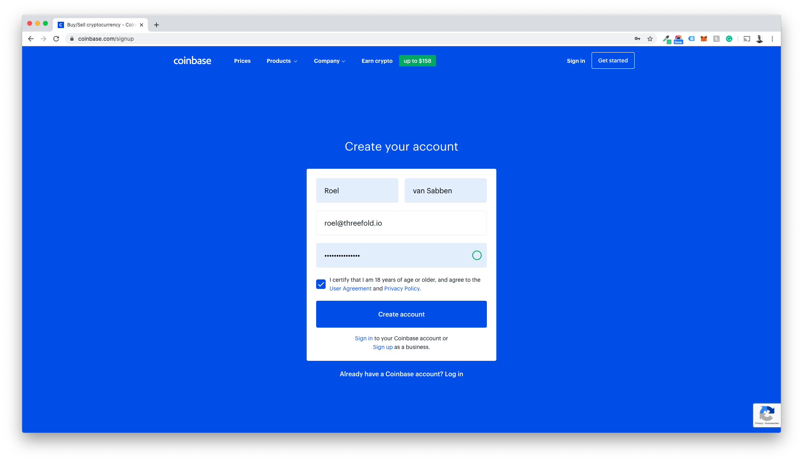
- After signing up, a few steps will be presented (e.g. GDPR compliance notice, privacy policy acknowledgment, and newsletter preferences).
- After this step, it is required that you verify your email address.
- After verifying, you will have to add a mobile phone number where you can receive SMS messages (e.g. for confirmation).
- After clicking 'Send Code,' you will have to fill in the code received in the text sent by Coinbase.
- Coinbase by law has to ask and verify your identity. These are the last steps to take. Make sure all information provided is correct as stated on your ID.

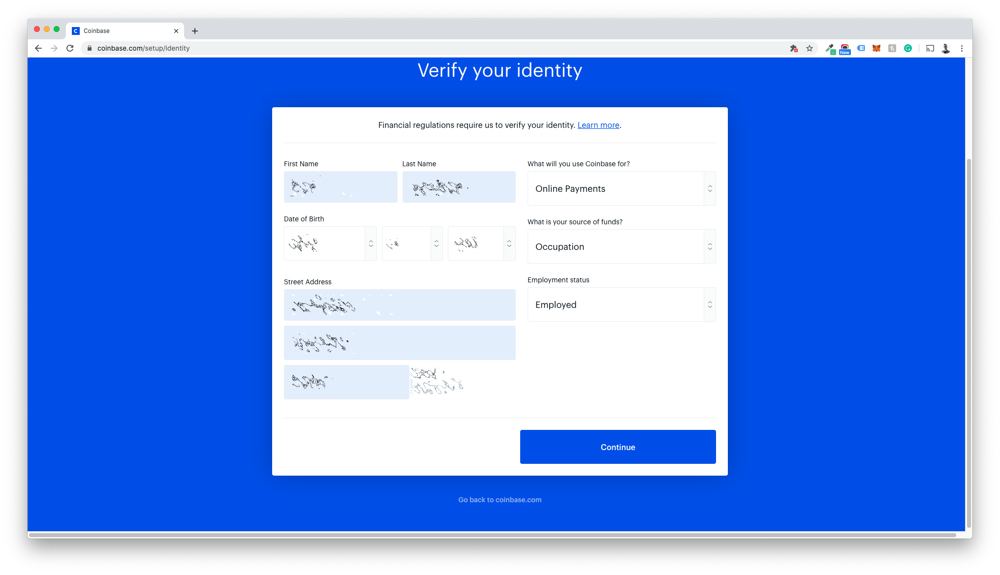

- To verify your input, Coinbase will need you to upload a valid ID. (These options can differ per user.)

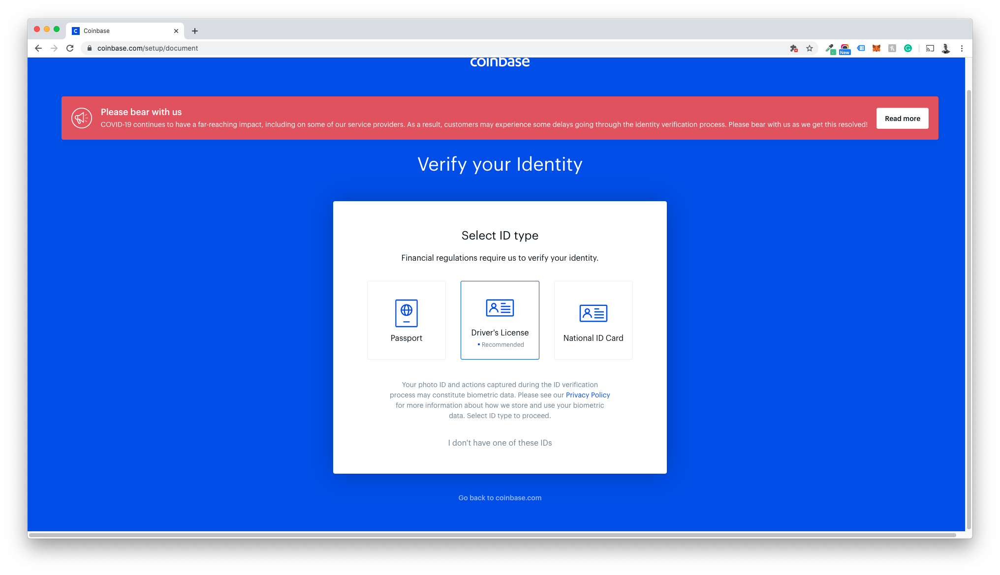

- For uploading purposes there are 3 options: webcam, phone camera, & file upload. For this example, we have used the webcam option to send both the front and back of the ID.

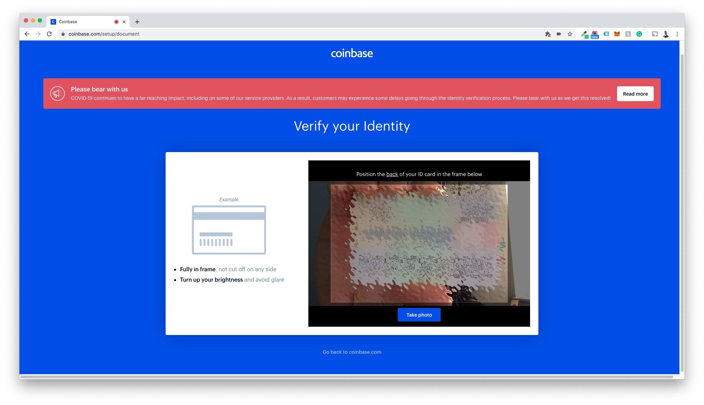

- Coinbase will now verify your documents; this might take up to a few minutes.

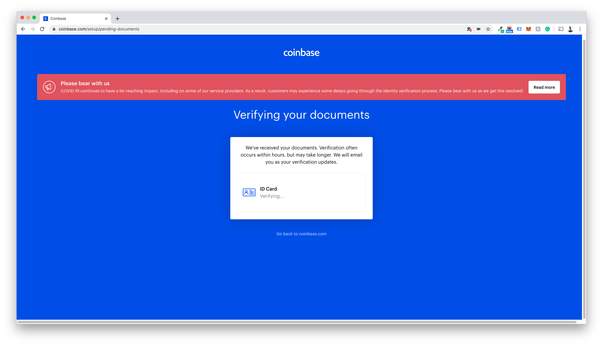

You are now onboarded!

## Coinbase funding exchange

1. Visit [https://www.coinbase.com/dashboard](https://www.coinbase.com/dashboard) and click trade
   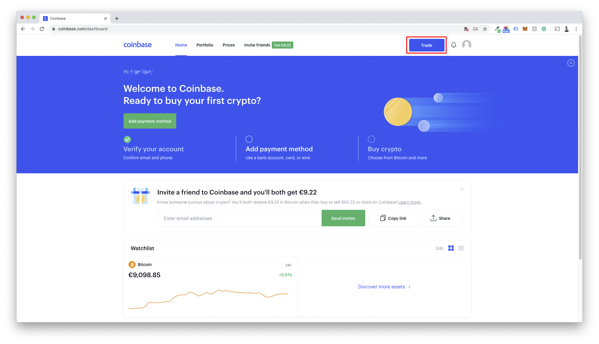

2. Add your preferred payment method (in the example below we show a bank transfer)

Specify:

- Bank Name
- Account Holder Full Name
- Amount

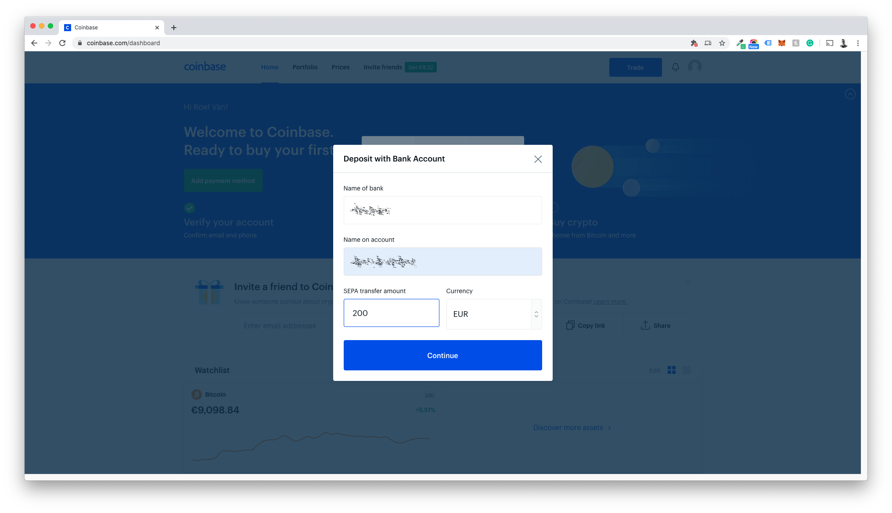

3. Write down the reference number displayed (make sure you save this number)
   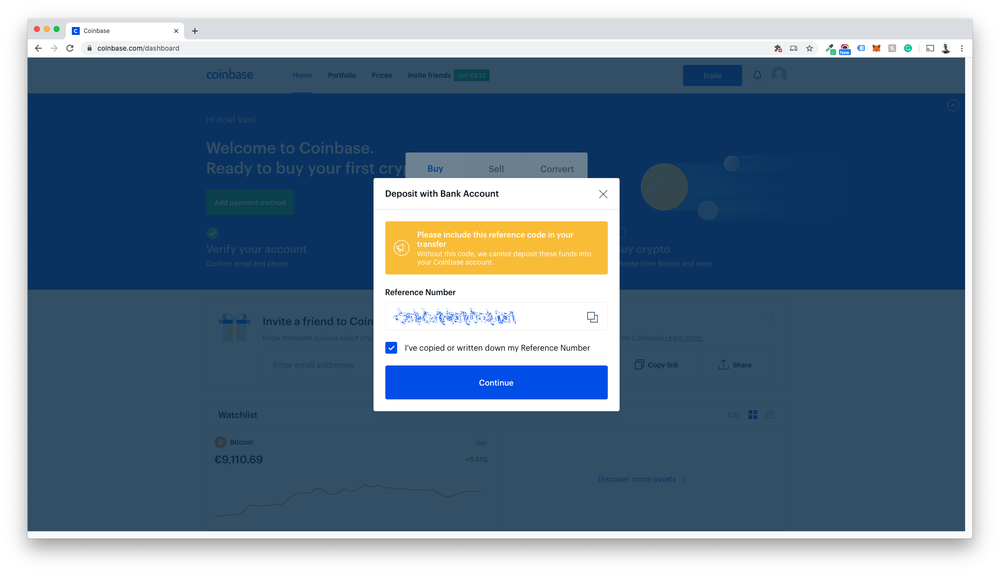

4. Wire the amount from your account to the location shown on the screen (note: this may differ from what is shown in the screenshot)
   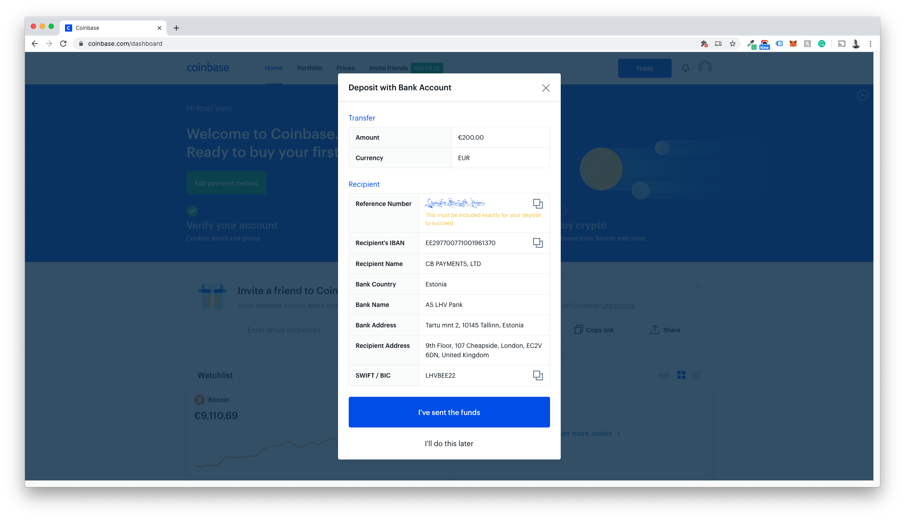

5. Wait for the funds to appear in your account. This may take a while, and normally Coinbase sends the account holder an email.

## Exchanging your fiat for digital currency.

For this part of the manual, we unfortunately cannot provide any screenshots other than the ones on display (Dutch Language) as this setting seems to be tied to the account holder’s (in this case, a cool Dutch guy :)) nationality.

We'll be buying XLM (Stellar Lumens) in this scenario, which is Stellar's token.

1. Click Trade

2. Choose XLM and the wallet that holds your funds
   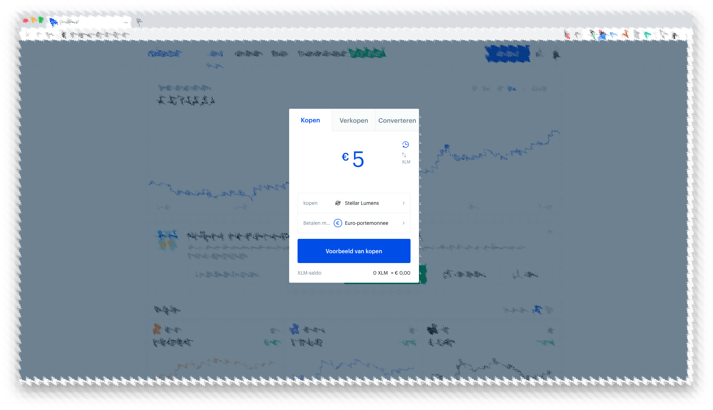

3. Click Preview
   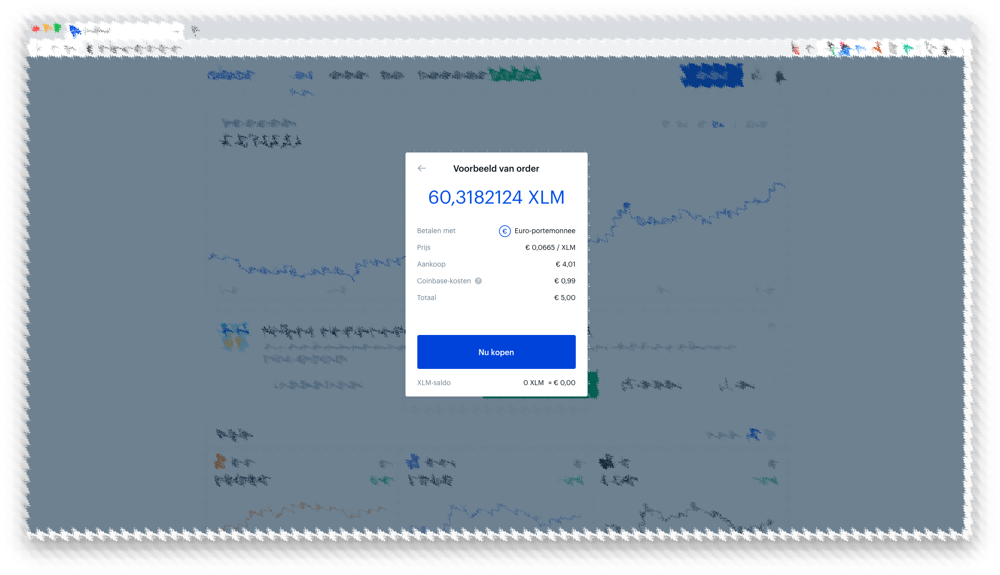

4. Click Buy Now if you agree with the preview of sale
   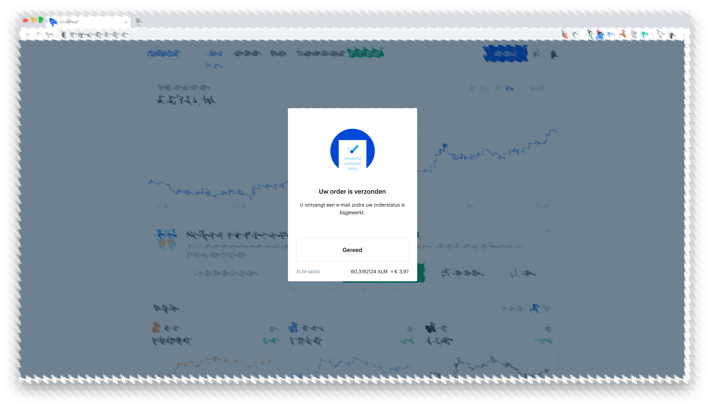

5. The XLMs bought will now show up in your wallet
   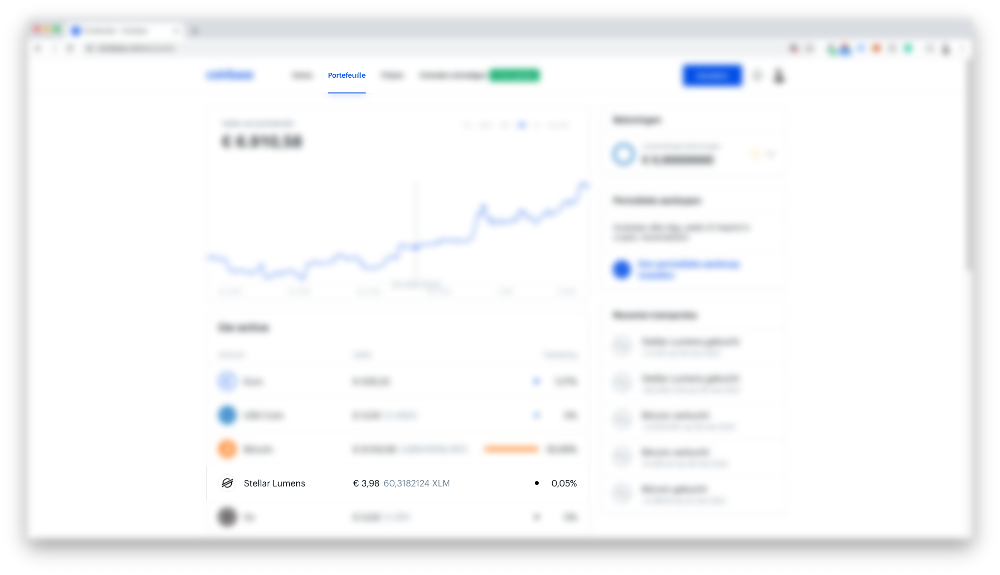

Congratulations! You now have XLMs in your wallet and you are ready to buy ThreeFold_Tokens!

[To continue the journey go back to overview doc.](fiat_to_tft)

!!!include:legal:tft_not_speculative_note
