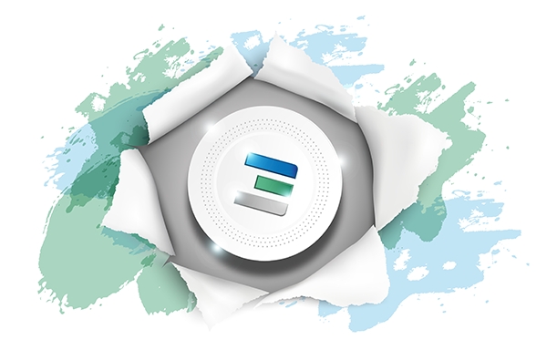
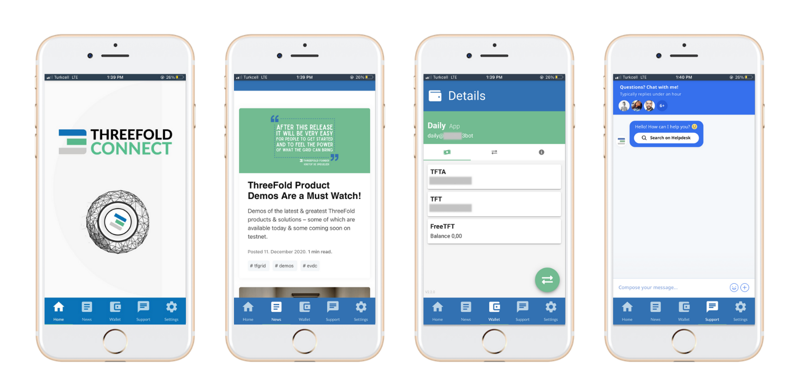
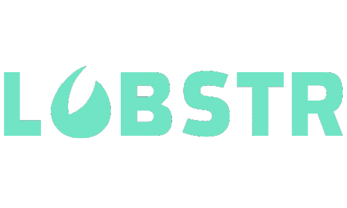
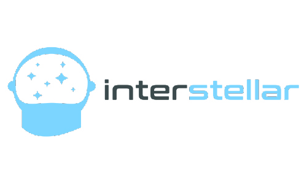

# Storing ThreeFold_Tokens

There are several options to store your TFT. 

## The ThreeFold Connect App

The ThreeFold Connect app is the official Threefold app that comes with a wallet feature.

Learn more about the Threefold Connect App [here](threefold_connect).

## Alternative XLM Wallets

Any wallet that can hold XLM based tokens can also hold TFT. Here's a few options for you to consider:

### Solar Wallet

Secure, open, and 100% free, this Stellar wallet features multi-signature accounts, asset management, and more. It is available on: Web, Iphone, Android, Mac, Windows and Linux.

Get your Solar wallet [here](https://solarwallet.io/).

### Lobstr Wallet

LOBSTR is a leading platform for managing Stellar Lumens and other assets issued on the Stellar network. With over 700 positive reviews LOBSTR is one of the most popular and trusted wallet solution for Stellar. It is available on: Web, Iphone and Android.

Get your Lobstr wallet [here](https://lobstr.co/).

### Interstellar Wallet/Exchange

Interstellar Wallet is a secure non-custodial wallet that enables you to control your private keys, and all your sensitive data is encrypted with the highest levels of security. Interstellar is the only app that supports multiple wallets which can be backed-up and restored easily.It is available on: Web, Iphone, Android, Mac, Windows.

Get your Interstellar wallet [here](https://interstellar.exchange/)