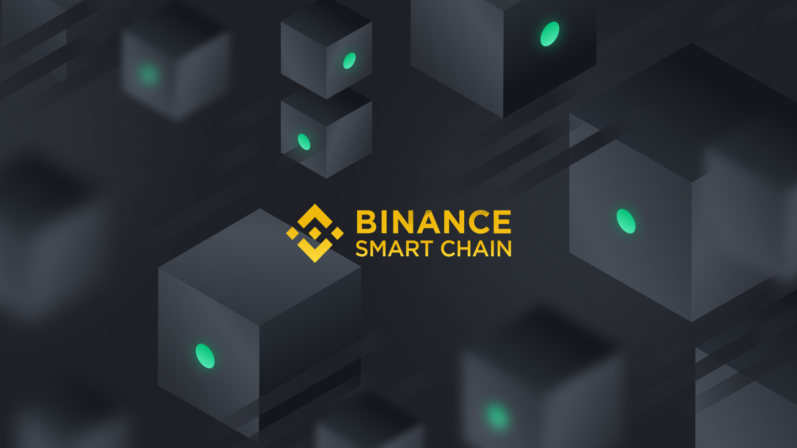

# How to buy TFT on Binance Smart Chain

Binance Smart Chain (BSC) is a blockchain network built for running smart contract-based applications. BSC runs in parallel with Binance's native Binance Chain (BC), which allows users to get the best of both worlds: the high transaction capacity of BC and the smart contract functionality of BSC.

### Advantages

- lots of liquidity
- automatic price governance, thanks to DEFI technology like pancake swap
- low transaction fees
- fast

Thanks to Pancake swap its easy for people to find liquidity if they want to buy/sell their TFT.
The price get's adjusted in accordance to available liquidity.

> MORE INFO COMING SOON

More info see https://www.binance.org/en/smartChain