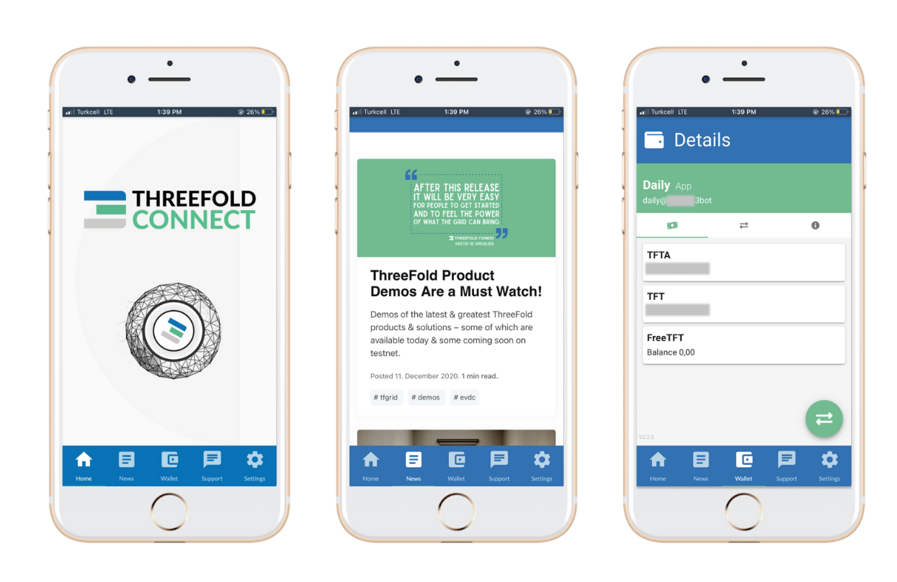

# Storing ThreeFold Tokens

There are several options to store your TFT. 

## The ThreeFold Connect

The ThreeFold Connect is the official authentification app used to access your Digital Twin and comes with a wallet feature. 

Learn more about the Threefold Connect App [here](threefold_connect).

## Alternative Stellar (XLM) Wallets

Any wallet that can hold XLM based tokens can also hold TFT. Here are a few options for you to consider:

### Solar Wallet

Secure, open, and 100% free, this Stellar Wallet features multi-signature accounts, asset management, and more. It is available on Web, iPhone, Android, Mac, Windows and Linux.

Get your Solar Wallet [here](https://solarwallet.io/).

### Lobstr Wallet

LOBSTER is a leading platform for managing Stellar Lumens and other assets issued on the Stellar network. With over 700 positive reviews, LOBSTER is one of Stellar's most popular and trusted wallet solution. It is available on Web, iPhone and Android.

Get your Lobster wallet [here](https://lobstr.co/).

### Interstellar Wallet/Exchange

Interstellar Wallet is a secure non-custodial wallet that enables you to control your private keys, and all your sensitive data is encrypted with the highest security levels. Interstellar is the only app that supports multiple wallets which can be backed up and restored quickly. It is available on Web, iPhone, Android, Mac, Windows.

Get your Interstellar Wallet [here](https://interstellar.exchange/).