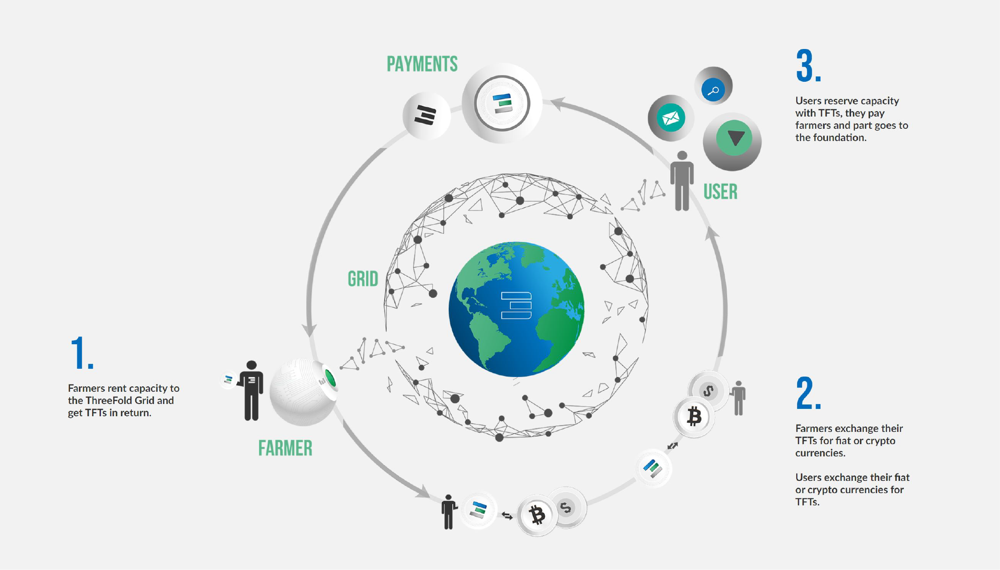

# Threefold Token (TFT)

## What is TFT? 
The TFT is the currency of the peer-to-peer Internet - the Threefold Grid. It represents a unit of reservation of capacity (Compute and/or Storage) and is the official medium of exchnage on the Threefold Grid. 

## What can I do with TFT? 
Users, developers, and enterprise use TFT to reserve the capacity they need to create, use and share their data, IT workloads and applications on the network. 

With TFT, you can use the following products and services that lives on the Threefold Grid: 
1. Digital Twin for life: Your unique Digital ID that assures that you own your data, and no one else. Access numerous applications in full security and privacy 
2. Threefold Peer-to-Peer Cloud: Reserve and use cloud capacity. For more information, see [here](https://cloud.threefold.io/)

## Where do TFTs come from?
When farmers connect servers (3Nodes) to the ThreeFold Grid, they farm (mine), expand the grid and get rewarded with TFTs. 

## Why selling Digital Twin for Life in TFTs? 

Being built on top of the Threefold Grid, the TFT is used as a medium of exchange to reserve & buy capacity from the grid's farmers and to support to token economy. 

## A Circular Token Economy 

<!-->> TO DO: Create Circular Token Economy Image including Digital Twin -->

A circular economy enables anyone to take part and to get rewarded for it:

1. When farmers connect 3Nodes and add capacity to the Threefold Grid, they will create new TFT through the process of farming. 

2. Farmers can then exchange the farmed TFTs into other fiat or digital currencies on public exchanges. Also this is where users can exchnage fiat or digital currencies for TFTs. 

3. Once they have TFTs in their wallets, users can buy Digital Twin for Life directly with us  (the subscription already include YYY gb of capacity on the Threefold Grid) and, also, reserve additional capacity on the Threefold Grid and pay farmers directly. 
