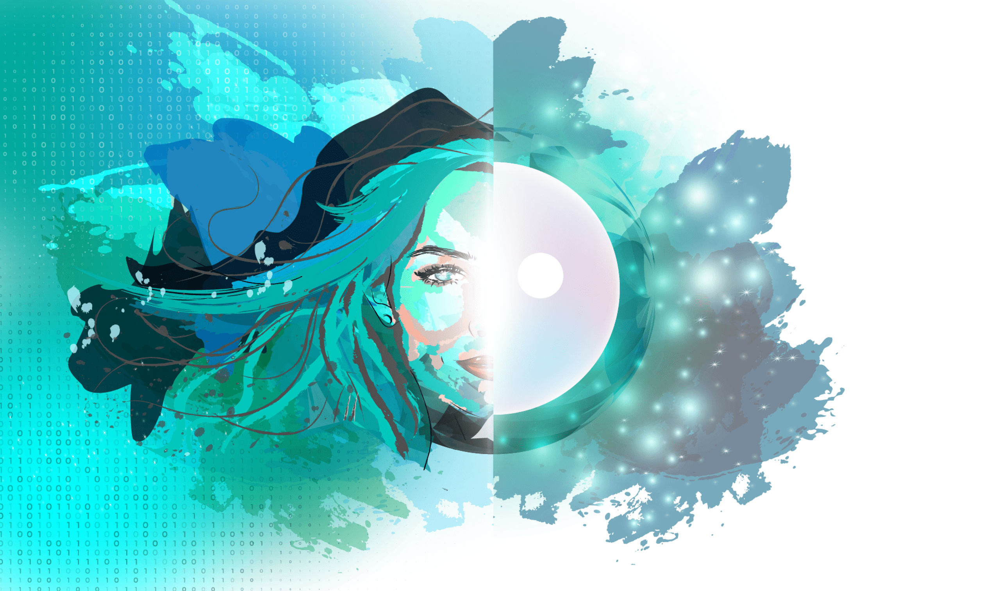

# How we see the world 

Imagine a world where the internet functions as how it was supposed to, where people enjoy their digital life in full security and privacy. A world where you claim full ownership and control over your data. An environment in which you live in full confidence and assurance of not being recorded or watched.

What if this digital life is waiting behind your door?

With our peer-to-peer Threefold Grid ("TF Grid"), Digital Twin declared that it is time for all of us to claim our freedom, our data ownership, our privacy, and digital security. With a you-centric approach, you will not be the product anymore - Actually, you will be at the center of your digital world, thus possessing control over your personal data. 

Digital Twin sets the foundation for a new and better digital world and experience based on new principles:

**Peer-to-Peer**: Without any intermediaries, users go directly to the source on the TF Grid. For instance, thanks to Digital Twin and its phone book, two friends have the opportunity to chat and call each other on a secure peer-to-peer application, on which only them will possess data of their chats and phone calls - not even us!

See more about the strength of [Peer-to-Peer](power_of_p2p)

**Decentralized**: At launch, TF Grid has been distributed across 20+ countries. Digital Twin uses Threefold's decentralized architecture, thus, ushering benefits such as security, cost-efficiency and sustainability amongst others. The expansion and accessibility to regions needing internet capacity the most shall be incentivized and/or sponsored by the foundation itself. 

**Autonomous**: Being implemented on the TF Grid, which is proven, self-sustainable and self-healing, allow our technology to be extremely resilient and enable data availability even in the unlikely event that the data base goes down. 

**Private & Secure**: By withdrawing human interference, our technology already eliminated many backdoors present in the current architecture. Along with the peer-to-peer and autonomous approach, Digital Twin community gains and enjoys an exceptional private digital life. 

**Efficient**: Less is more — no need to have hundreds of different and separate applications. Digital Twin provides you with different experiences in one place.

**Equal**: Internet access should be available to everyone. The TF Grid solutions position themselves as the most affordable on the market. As mentioned above, the TF Grid expansion to remote regions of our world will be incentivized and/or sponsored by the Foundation.

> Become part of the solution, by reserving your **Digital Twin for Life**.