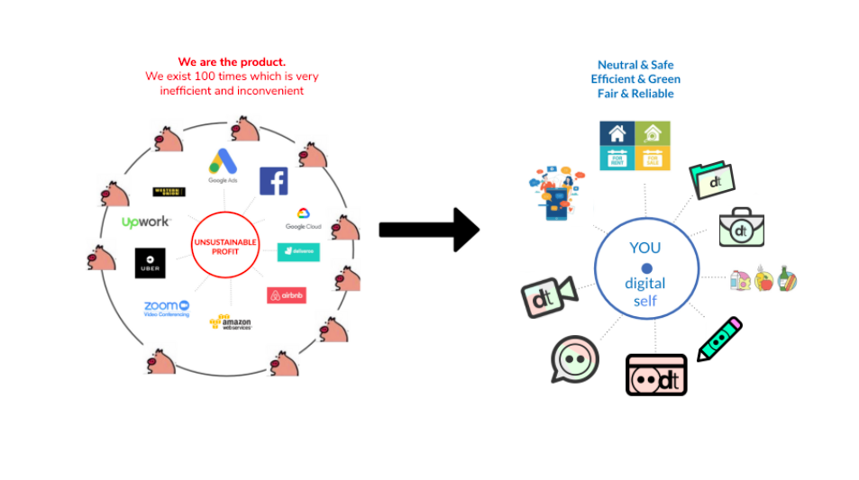

# One Digital Identity, One log-in
The era where we were in control of our computers' data is being replaced with devices containing sensors we cannot control, storing information we cannot access, operating systems we cannot monitor, in environments where our rights are rendered meaningless. But now, Digital Twin is bringing a shift to this mess. 

It is time to regain power over our data and be the owner of our cloud. Our Digital Twin solution will provide you with a unique digital identity. You will be the only one controlling who can/cannot have access to your data - No more hundred of doppelgangers and no more undesired or targeted ads. 

With our secured [Threefold Connect](threefold_connect), you will need only ONE log-in, ONE password, ONE authentification, and you are in - Your new digital world. With our [Peer-to-Peer architecture](power_of_p2p), connect, share and exchange with your family, friends, colleagues and community peacefully without intermediaries and fear of being watched. All your data will be encrypted and kept safely in a quantum-safe manner.

Learn more on how your data is quantum-safe, [here](qsstoragesystem)

We believe that this unhealthy game between us and free apps has come to an end, and the you-centric app era has begun. With the different experiences, enjoy the feeling of being at the centre, surrounded by apps working for you and not the other way around.

 

**With Digital Twin, you are not the product anymore.**

