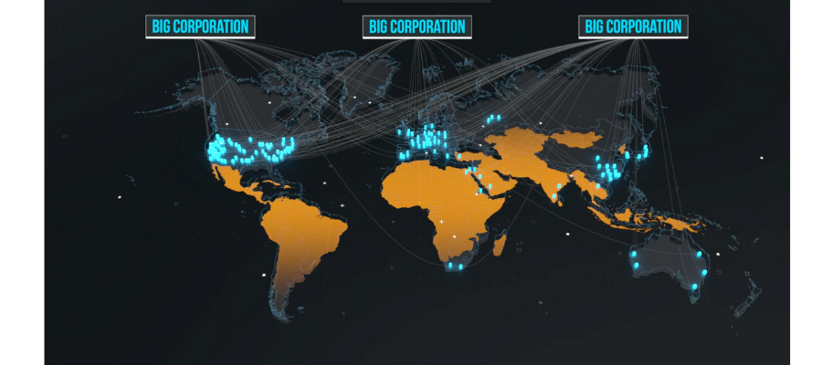

# Our digital Problem
 

The Internet was created to be opened in access, for everyone, and by everyone. However, with its existing infrastructure ruled by big corporations, people are turned into a product by a centralized model, which is unsustainable and way too complex.

The urge for true decentralization in the data economy is manifesting itself in two ways: 
- [Decentralization of the digital infrastructure in terms of ownership and locality/distribution](why_infrastructure)
- [Decentralization of information in terms of ownership and privacy of information](why_information).

