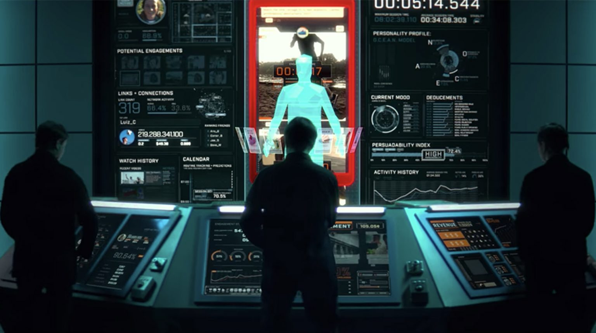

## Decentralization of information 

Digital Citizens, governments, policy makers, smart cities, indigenous tribes and municipalities are all demanding data ownership. The ability to provide data ownership to all parties involved while maintaining full regulatory requirements as well as security, scale & privacy is really important.

There is a growing global awareness of the value of our data economy and that ownership, privacy and sovereignty shouldn’t be negotiable. 

Have you watched The Social Dilemma and the Great Hack? 

These documentaries show how people are manipulated and targeted due to their social media platforms' activity or data. 

But something we need to agree upon. The internet was meant to be different. In the beginning, no one would own the internet. No one could own the internet. The internet belonged to all of us. We live in a technological miasma where beyond our control and comprehension, the internet lost its edge. 

It became about monetizing your clicks and swipes, buying and selling your data about your clicks and swipes, getting you algorithmically addicted to click and swipe some more—all of this to build up spurious advertising profiles about you. 

Do you remember when you could create your own safe space and decide what others see and know? Now, whether you are at home, in the middle of a city, or hiking a mountain, you’re never really alone. More and more, the technology we use today is connected to the Internet. Smartphones, TVs, cars, fridges and even baby monitors send out data about you and your surroundings 24/7 without your consent or control.

Think about the bigger picture. All those tiny bits of data, when pieced together, create a profile of yourself called your digital doppelgänger to indicates your political views, tastes, buying habits, sexual preferences, health data and much more. In fact, there are already hundreds or thousands of digital doppelgängers about you held by different companies and government. 

*Illustration of Doppelgangers in Social Dilemma, Netflix*

The reason is simple: predicting your behaviour and use it to their advantage. 

## One Digital Identity 

We live in an era where we have hundreds or even thousands of digital identities for companies to predict our behavior and to target us for unnecessary ads. A life where we are not in control of who has access to our data, manages, uses and stores it. But now, with Digital Twin solution, enter your digital world with one identity, one log-in, one password, one authentification and regain power over your data. 

With Digital Twin, you are not the product anymore. 

Learn more about your digital world and your digital identity, [here](one_digital_identity)

