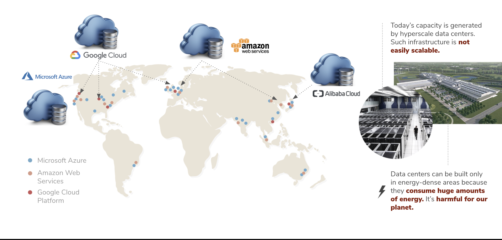
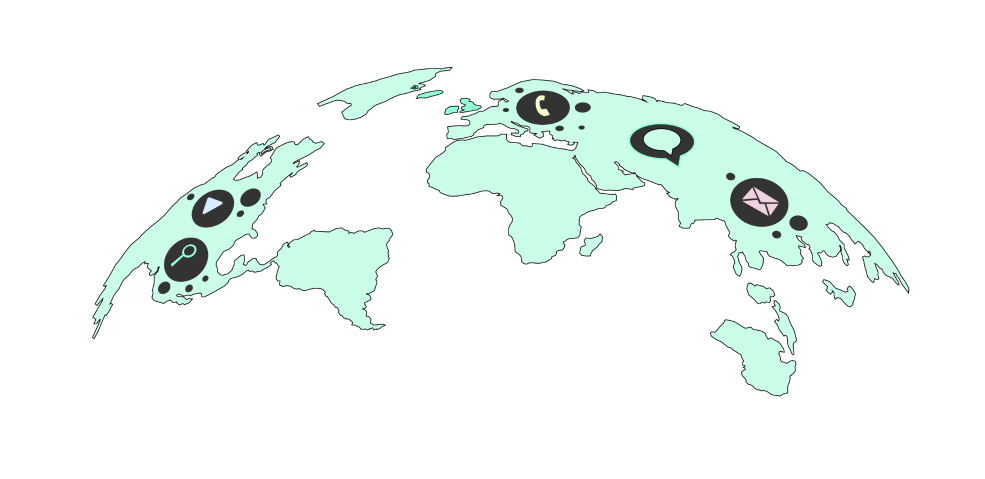

# Decentralization of Digital Infrastructure

In order to serve emerging digital workloads such as edge computing, IOT, 5G, AI, swarm learning, VR, autonomous transport, blockchain, and more, the world is in need of scalable, ultra-secure, and decentralized digital capacity everywhere, on demand.

Today, more than 80% of the Internet’s capacity is owned by centralized cloud providers. The capacity is derived from hyper-scale data centers - an infrastructure that is incredibly costly, not scalable and super unsustainable. As of today, the internet consumes about 10% of global energy resources.

Moreover, data centers which are located in handful locations in wealthy nations, are where all of your key data is currently stored. Your photos, emails, chats, videos and every single part of your digital identity is tracked, stored and used by someone else. 

We believe that centralization is the key problem of our actual unsustainable system. It concentrates on decision-making and operates as a transmission mechanism to transmit and amplify the effects of centralized decisions throughout the system. This means that when bad decisions are made - as inevitably happens in human behavior and nature - the entire system will be damaged. 

The current centralized infrastructure and system can also lead to unmoral activities such as mass surveillance that affects our human right, freedom and it enable significant power imbalances as well as damaging people’s autonomy and dignity. 

# Peer-to-Peer as the solution 

Today, online privacy and security are badly compromised with this centralized architecture and the implication of various intermediaries. The exchange of real values becomes impossible. Digital Twin believes that peer-to-peer models is the solution to empower communities with equality, sovereignty, sustainability and resiliency. 

Digital Twin uses the power of Threefold Peer-to-Peer Network to provide you with privacy, security while enjoying a seamingless experience. 

Learn more about Peer-to-Peer, [here](power_of_p2p)
