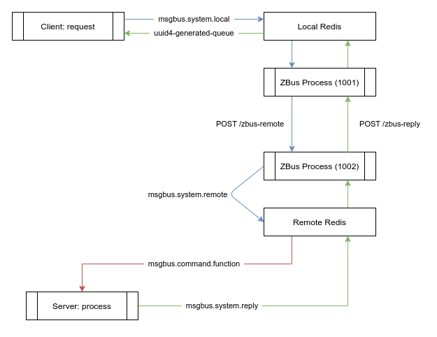

# Reliable Message Bus Protocol





Object Schema:
```js
{
  "ver": 1,                                # version identifier (always 1 for now)
  "uid": "",                               # unique id (filled by server)
  "cmd": "wallet.stellar.balance.tft",     # command to call (aka function name)
  "exp": 3600,                             # expiration in seconds (relative to 'now')
  "try": 4,                                # amount of retry if remote cannot be joined
  "dat": "R0E3...2WUwzTzdOQzNQUlkN=",      # data base64 encoded
  "src": 0,                                # source twin id (filled by server)
  "dst": [1002],                           # list of twin destination id (filled by client)
  "ret": "5bf6bc...0c7-e87d799fbc73",      # return queue expected (please use uuid4)
  "shm": "",                               # schema definition (not used now)
  "now": 1621944461,                       # sent timestamp (filled by client)
  "err": ""                                # optional error (would be set by server)
}
```

This structure is used by client and server, everything is following this structure and theses field type.

Note, on this documentation, `local side` mean the digitaltwin/bus process where the message were sent.
The `remote side` is where the destination is. In practice, this can be the same twin (for inter-process
communication, for example). Queue usage are made to allow this.

# Sending a request

To send a request (aka call a remote function), you push your request (the json above) to your
local redis `msgbus.system.local` queue using `RPUSH` command.

The client can now wait on the `ret` queue for responses. Amount of expected responses is the same as length
of destination requested (here, only one: `1002`), so only a single response should arrive.

Responses arrives one by one.

# Processing a request

The ZBus process is waiting on `msgbus.system.local` for incoming messages. As soon as a message is received,
the bus process resolve destinations id (fetch ip/port from tfgrid), then forward the request to destination
zbus-server over HTTP. Each zbus server listen to `/zbus-remote` and `/zbus-reply` HTTP POST endpoint.

This method allows redis to only listen locally and inter-zbus talks to each other using HTTP.

To forward the request, `ZBus Process` rewrite `dst` field to only put single destination (the expected one by remote)
and set the `src` field with it's own digitaltwin id. An internal counter is incremented, based on remote id.
This id and counter is used to create the `uid` field which is `unique id` to identify the message
(eg: `'1002.174'` for the `174th` message to destination `1002`).

Bus process rewrite the original request to this:

```js
{
  "ver": 1,                                # version identifier (always 1 for now)
  "uid": "1002.117",                       # unique id (filled by server)
  "cmd": "wallet.stellar.balance.tft",     # command to call (aka function name)
  "exp": 3600,                             # expiration in seconds (relative to 'now')
  "try": 4,                                # amount of retry if remote cannot be joined
  "dat": "R0E3...2WUwzTzdOQzNQUlkN=",      # data base64 encoded
  "src": 1001,                             # source twin id (filled by server)
  "dst": [1002],                           # list of twin destination id (filled by client)
  "ret": "5bf6bc...0c7-e87d799fbc73",      # return queue expected (please use uuid4)
  "shm": "",                               # schema definition (not used now)
  "now": 1621944461,                       # sent timestamp (filled by client)
  "err": ""                                # optional error (would be set by server)
}
```

In case of error (eg: requested destination not found), the `err` field is filled with explicit text error
and the response is directly pushed to `ret` queue.

```js
...
  "err": "destination not found",
...
```

If everything is okay, the remote bus server will receive this request over HTTP and push it to local redis
to `msgbus.system.remote` queue of the and replace `ret` field by `msgbus.system.reply`.

A copy of this request is stored in local redis `HSET msgbus.system.backlog` with `uid` as key. This
backlog is used to match reply with corresponding original request, to ensure reply comes from a legitim request
and save original reply queue.

# Processing a request on the remote side

On the remote side, a local redis and another `ZBus Process` is running. The `ZBus Process` is waiting event on
HTTP POST `/zbus-remote` and will transfert legit request to local redis queue `msgbus.system.remote`.
This queue will be proceed by main task and parse request sent by `1001`.

The message is forwarded **as it** to `msgbus.$cmd` queue. An application should wait for message on that
queue to process the request and send the reply to the `msgbus.system.reply` local queue.

The application should swap `dst` and `src`, set the `dat` with response payload (base64 encoded) and update
`now` field with response time.

# Processing a reply, on the remote side

When a reply is found by `ZBus Process` on the remote side, in the queue `msgbus.system.reply`, this message
is extracted from the queue.

Because the destination id doesn't match with the local id, the message is forwarded **as it** to `dst`
server (resolved), over HTTP POST `/zbus-reply`.

# Processing a reply, on the local side

When receiving a message over HTTP POST `/zbus-reply`, the legit request is copied into `msgbus.system.reply` queue
and will be parsed by main redis task. The same way as remote side, when a message will be found on
the `msgbus.system.reply` queue, but this time the `dst` id will match with local id, so the `ZBus Process`
knows this reply was for him.

The `uid` from that reply is used to fetch back the original message from the `HSET msgbus.system.backlog`. This
allow the process to find back the original `ret` queue. The `ret` is replaced with original value and this
message is then forwarded to that specific queue.

# The response is available on the return queue

Source application now get the reply message on it's expected queue.

```js
{
  "ver": 1,
  "uid": "1002.117",
  "cmd": "wallet.stellar.balance.tft",
  "exp": 3600,
  "try": 4,                                  # amount of retry left when proceed
  "dat": "MTgwMjQ4ODQuMTM5MzQxOQ==",         # response base64 encoded
  "src": 1002,
  "dst": [1001],
  "ret": "5bf6bc...0c7-e87d799fbc73",
  "shm": "",
  "now": 1621944462,                         # response generated time
  "err": ""
}
```


# Example (Getting stellar wallet balance)


## Server

```js
const StellarSdk = require('stellar-sdk');
const server = new StellarSdk.Server('https://horizon.stellar.org');
const msgbus = require('./msgbus')

function wallet_stellar_balance_tft() {
    if(this.payload.length != 56)
        return this.error("invalid address format")

    console.log("[+] stellar: query address: " + this.payload)

    server.loadAccount(this.payload).then(account => {
        for(var i in account.balances) {
            balance = account.balances[i]

            if(balance.asset_code == "TFT") {
                console.log(this)
                this.reply(balance.balance)
            }
        }
    })
}

var commands = {
    "wallet.stellar.balance.tft": wallet_stellar_balance_tft,
}

mb = msgbus.server(commands, 6379)
mb.serve()

```
Here we spawn server on port 6379 with registered command `wallet.stellar.balance.tft` that invokes the function `wallet_stellar_balance_tft` when requested


## Client

In the following snippet we will show how to execute `wallet.stellar.balance.tft` on the server via the msgbus

```js
const msgbus = require("./msgbus");

mb = msgbus.connect()
mb.prepare("wallet.stellar.balance.tft", [1002], 0)
mb.send("GA7OPN4A3JNHLPHPEWM4PJDOYYDYNZOM7ES6YL3O7NC3PRY3V3UX6ANM")
values = mb.read()

console.log(values)

```

Note: `prepare` prepares the payload of the request (command, destination, expiration)


## Example (Commmunicating with TFGridDB)

```js

const { MessageBusServer } = require('./msgbus')

// test mnemonic
const mnemonic = "industry dismiss casual gym gap music pave gasp sick owner dumb cost"
const Client = require('tfgrid-api-client')
const url = "wss://explorer.devnet.grid.tf/ws"
const DbClient = new Client(url, mnemonic)

sync function createTwinHandler(message, payload) {
  await DbClient.init()
  console.log(`create twin payload: ${payload}`)
  const block = await DbClient.createTwin(payload)
  return block.toHex()
}

async function getTwinByIDHandler(message, payload) {
  await DbClient.init()
  console.log(`get twin by id payload: ${payload}`)
  const twin = await DbClient.getTwinByID(parseInt(payload))
  return twin


const msgBus = new MessageBusServer(6379)

msgBus.withHandler("griddb.twins.create", createTwinHandler)
msgBus.withHandler("griddb.twins.get", getTwinByIDHandler)

msgBus.run()

}

```
Here we created a simple server that has two commands for interacting with TGridDB (creation and retrieval)

## client

```js
const { MessageBusClient } = require('./msgbus')

const mb = new MessageBusClient(6379)


mb.read(message, function (result) {
  console.log("result received")
  console.log(result)
})

mb.prepare("griddb.twins.create", [1002], 0)
mb.send("some_peer_id")
values = mb.read()

console.log(values)

const twinsget = mb.prepare("griddb.twins.get", [12], 0)
mb.send(twinsget, "1")
mb.read(twinsget, function (result) {
  console.log("result received")
  console.log(result)

  console.log("closing")
  process.exit(0)
})

```
Here we interact with the server.js over the msgbus to invoke the commands `griddb.twins.get` and `griddb.twins.create`
