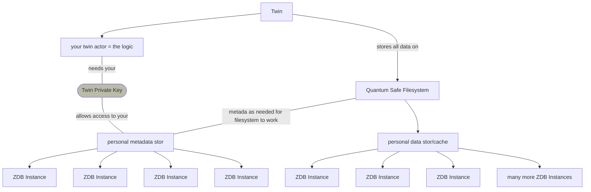

## QSFS in relation to TWIN

```mermaid
graph TB

    QSFS --metada as needed for filesystem to work--- META_STOR[personal metadata stor]
    Twin --> logic[your twin actor = the logic]
    logic --needs your--- key([Twin Private Key])
        style key fill:#bba
    key --allows access to your---META_STOR
    Twin --stores all data on--> QSFS[Quantum Safe Filesystem]
    QSFS --> ZDB_LOCAL[personal data stor/cache]    
    ZDB_LOCAL --> ZDB1[ZDB Instance]
    ZDB_LOCAL --> ZDB2[ZDB Instance]
    ZDB_LOCAL --> ZDB3[ZDB Instance]
    ZDB_LOCAL --> ZDB...[many more ZDB Instances]
    META_STOR --> ZDB10[ZDB Instance]
    META_STOR --> ZDB11[ZDB Instance]
    META_STOR --> ZDB12[ZDB Instance]
    META_STOR --> ZDB13[ZDB Instance]  
```