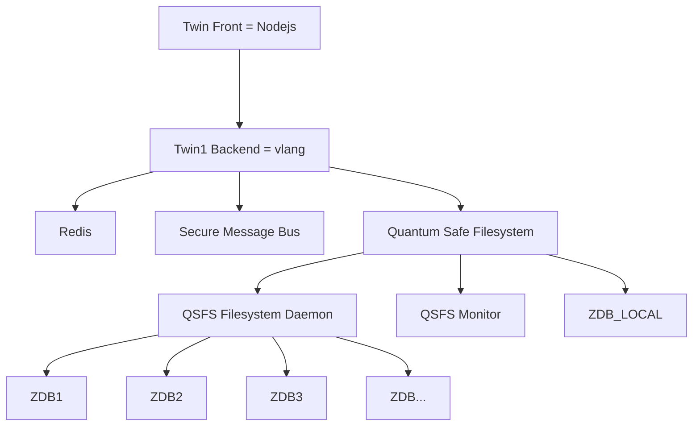
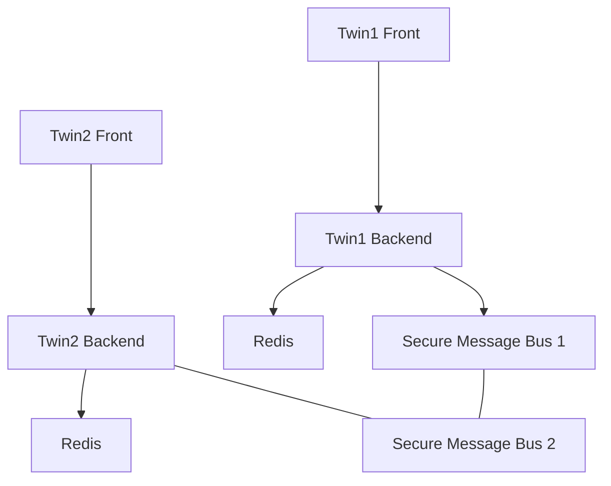

# Twin Architecture High Level

- quantum safe filesystem used to store all data
- all data as json's in nicely structured directories
    - for now indexing in redis (for lookups)
    - walk over FS -> poor man index in redis
- the SMB realizes communication between twins
- data can never be lost

> TODO: complete the QSFS part

## 2 twins talk to each other

