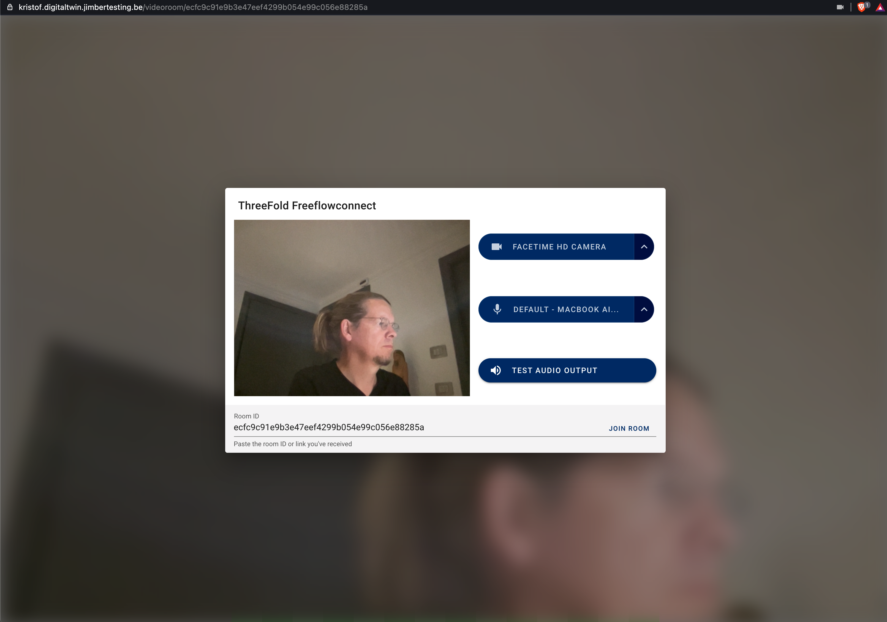

# Video Chat

## Features

Everything you would expect from Zoom (-: 

But everything runs peer2peer, no centralization.

This results in

- power savings
- less bandwidth usage
- more security & privacy
- more performance (if not close to zoom servers)

Extra benefits

- nicely integrated in Digital Twin app, no separate experience.

!!!include:twin_toc