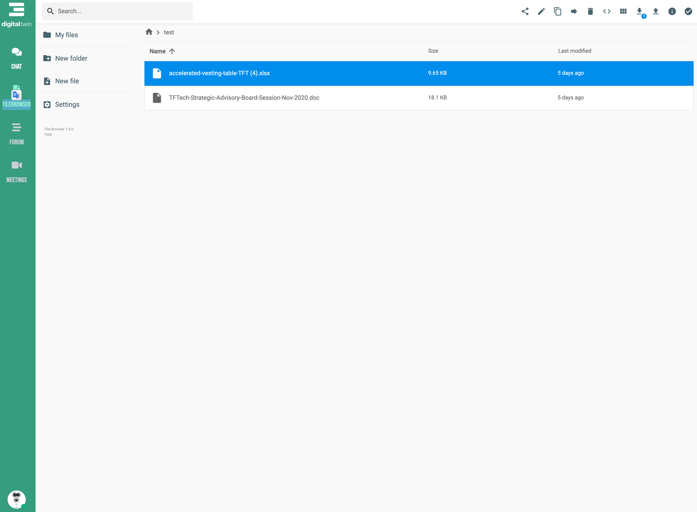
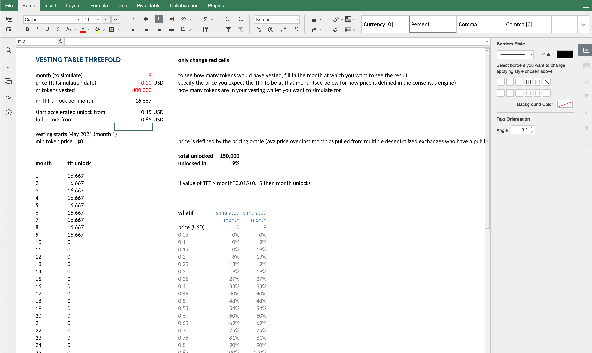
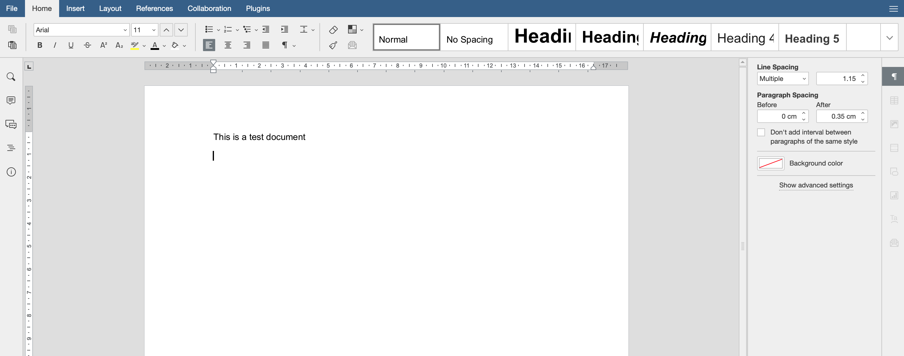

# AYDO

## Benefits

- completely compatible with MSOffice
- 100% private and linked to your digital twin
- collaboration features
- peer2peer communication, no centralization
- results in more green, private, higher performance, ...

## Office Integration

## Milestones

| Name   | Date | Funding needed (TFT) | Description                        |
| :----- | ---- | -------------------- | ---------------------------------- |
| V0.9.0 | tbd  | tbd                  | all basic functionality integrated |
| V0.9.1 | tbd  | tbd                  | sync                               |
| V0.9.2 | tbd  | tbd                  | granular security                  |
| V1.0   | tbd  | tbd                  | fuse layer, mount as filesystem    |
| V1.1   | tbd  | tbd                  | streaming interface (video/audio)  |
| V1.2   | tbd  | tbd                  | integration with digital twin      |
| V1.3   | tbd  | tbd                  | integration with the TF ZeroStor   |

