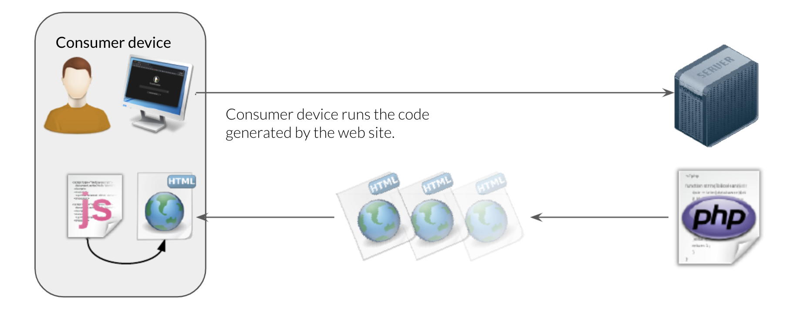
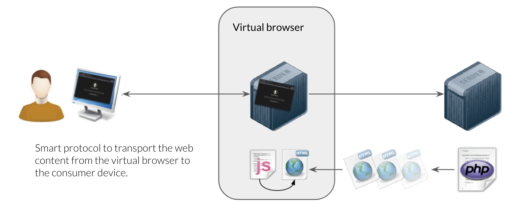

## Hercules Browser Tech

### Some History

The default way to consume content from the internet is to use a so called *browser*.  The world wide web is built based on a client server model where web servers store and process web content and web browsers are the single pane of glass access point to display all the available content.

Web 1.0 had static content (text + images) presented in the browser.The browwer dir no execute any code to make the web dynamic and personalized. This was a very a very secure environment. Static content also limited the amount of interaction and personalization that was possible on the content.

Later versions of the web became more dynamic and allowed data processing to be done in the browser.  This made personalized experiences possible but also opened up the browser as an interesting target for people with malicious intentions and hacking ambitions. The browser became the number one target for hackers and online crooks to try to get things from innocent and naive internet consumers.

The current state of play is that the browser is a very complex piece of software that processes a lot of information and allows data storage and processing activities to happen on consumer devices.  These consumer device are mostly badly maintained and are full with known security flaws and bugs.  The consumer is mostly unaware of this and want the personalised experience as it makes her or his life a lot more comfortable. 

### The Cloud Secure and Private Browser

The browser is the number one tool used by corporations and consumers to do everything online these days.  Applications are no longer installed on end user / consumer devices but "hosted" (installed) on central infrastructure and the browser is the one tool to consume all of these applications.  Software as a Service (SaaS)

In this service world the browser is defacto the new operating system for using applications and this comes with great responsibility for security as the browser is processing and storing a lot of data, software bugs and exploits now putting the end users device at risk of being hacked.

A solution to this problem is to take all that data processing and storing away from the consumers / users browser and have that done in a secure environment, away from the consumers device.  The "virtual" browser runs somewhere on the grid and act as the browser on behalf of the consumer.  The visual information from this virtual browser, eg. the user interface, is then "streamed" by a smart protocol to the real enduser browser this has just a display function.  The end user device no longer processes and stores code and data and we are almost back tot he situation of the early web where the browser was just presenting information, not processing and storing information.

Imagine this in combination with the [3x0](accelerator:3x0) secure environment how such a setup can be made very efficient, performing and safe.