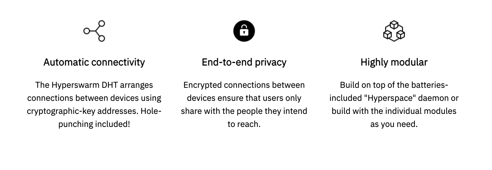

# Introducing our HyperDrive

Hyperdrive is a colleague of IPFS (InterPlanetary File System), but we believe it works better and more scalable.

The Digital twin adds the following benefits: 
- Your data can never be lost
- You have unlimited scalability - can store petabytes
- Sync with other datasets. For example: Synchronize automatically with your files on the [File Storage](filestorage)

Two ways to synchronize [DTFS](threefold:dtfs) with directory into HyperDrive:
- Expose HyperDrive link for publishing server,
- Link HyperDrive into filestorage

## More info

BitTorrent inspires the Hypercore Protocol. It creates networked datasets which users can seed in a distributed mesh. It also includes a variety of tools for connecting devices, streaming data, and running services.

- 100% compatible with https://hypercore-protocol.org/protocol/