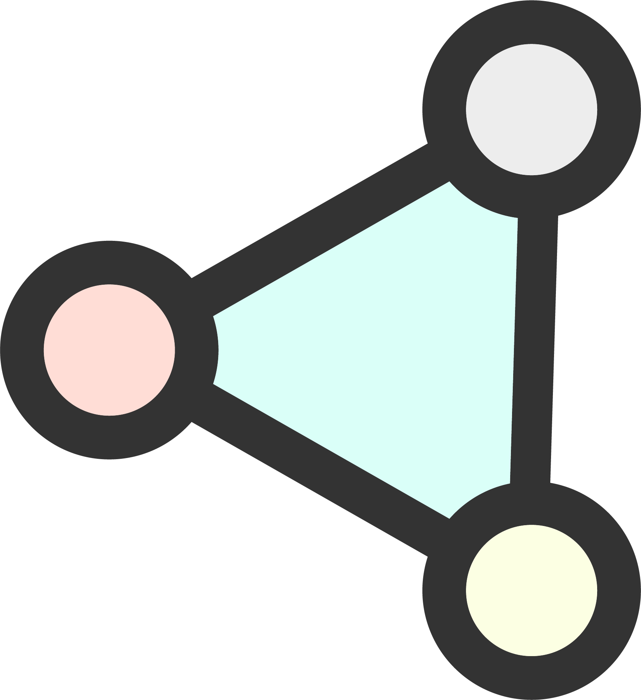

# Network

## Your new professional networking tool 

With Network, discover your new professional networking experience that empowers you to build your reputation. 

## Features 

### Keep your data private

We don’t hold nor use your personal data. What's yours remains yours. You won’t see any ads of any kind nor censorship on Network.

### Equal networking possibilities

With no premium accounts, meritocracy is back. Find audiences purely based on professional interests and experience. Connect, share, learn and build value together. 

### Trusted Recommendations

A recommendation from someone you know always beats an algorithm. With no algorithms nor tracking, you're now back in complete control of your networking experience.

### Interact with real people

Honesty and integrity are core principles for real exchanges. It won't be possible to remain anonymous or to hide behind fake profiles on Network.

### A peer-to-peer community 

Unlike other networking platforms, Network won't have any centralization of authority and power. The community itself reviews its peers and information to build reputation, just like it should be in real life.