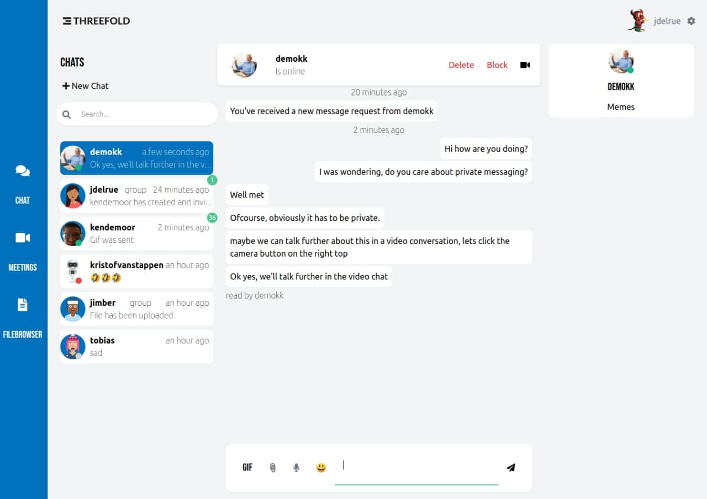

# DT Chat

## Get back your personal conversations
Using the chat tool in the DigitalTwin you can use real peer-to-peer communcation to safely and privately interact with other people in the Threefold network. Your DigitalTwin will be constantly online, saving your messages for when you have the time to read them. Expect the same experience as the best messaging applications out there, but with improved privacy, safety and ownership.

## Features

Our MVP version will be provided with following features:

- Direct p2p messaging
- Search for contacts 
- Add, delete, block and overall management of contacts
- Smileys :-)
- Groups functionality with admins
- Directly start video calls, meetings integration
- Send files
- Persistent storage 
- Sexy layout
- Quote/reply on your messages
- Edit messages
- Avatars
- Gifs (obviously)
- Online/offline status
- Status text
- Message read notifications
- Responsive design for mobile usage
- Sound message recording 
- New message notification

More features will be added in the future.

