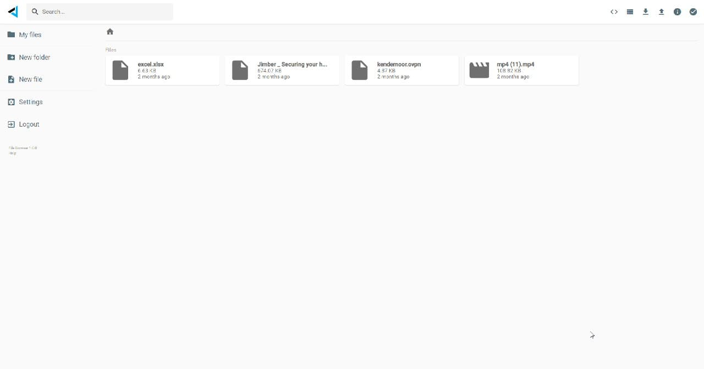

# Filemanager

A versatile webbased file manager lets you organize your digital life.

You can store upto a petabyte of information and data can never be lost.

## unique

...

## implementation

- files are stored on [digital twin filesystem](threefold:dtfs)
- interface = filebrowser xyz
- acl are metadata files in a directory (only support dir for now)
  - works with groups, simple rwd rights
  - identificaiton based on groupid (in group we have digital twinids or names)
- each DT has rest interface to expose file taking ACL's into consideration
- link feature = is a directory (specified as metadata), which links to remote directory of other DT

## roadmap

- integration with a sync tool like syncthing