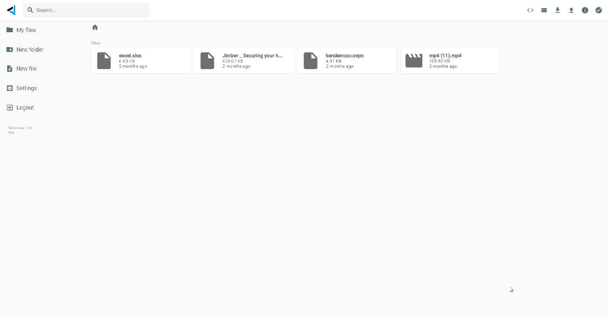

# File Storage

A versatile web-based file Storage lets you organize your digital life.

You can store up to a petabyte of information and data can never be lost.

## Features 

### Seamless Compatibility 

Photos, videos, presentations, PDFs, Office files, and more! All file formats and systems you may use are compatible with your file storage. 

### Your Data is Safe

Keep your data safe and private with most secure and reliable workspace on the market. Go hastle-free and ensure your files remain accessible even in the unlikely situation that your smartphone, tablet or computer goes down.

### Sharing Made Simple 

Keep your files private to yourself and those with whom you want to share them. Protection layers like password, comment or edit view, expiring links or viewing invitations are integrated to ensure your shared files where they should. 

### Affordable Storage

By using a unique storage algorithm, Digital Twin is able to store your files at a price equal to none. Enjoy 100x more storage space for the same price you would pay elsewhere.

### Ultra-Secure

File Storage is the first quantum safe permanent storage solution on the market. It is protected by blockchain and smart autonomous technology. No need for VPNs, Firewalls or antiviruses anymore. 

### Easy Access

Being web-based, your File Storage can be accessed on any device, from anywhere around the world. All you need is your login information and you're good to go!

## Implementation

- files are stored on [digital twin filesystem](threefold:dtfs)
- interface = filebrowser xyz
- acl are metadata files in a directory (only support directories for now)
  - works with groups, simple read-write rights
  - identificaiton based on groupId (in group we have digital twinIds or names)
- each Digital Twin has rest interface to expose file taking ACL's into consideration
- link feature = is a directory (specified as metadata), which links to remote directory of other DT

