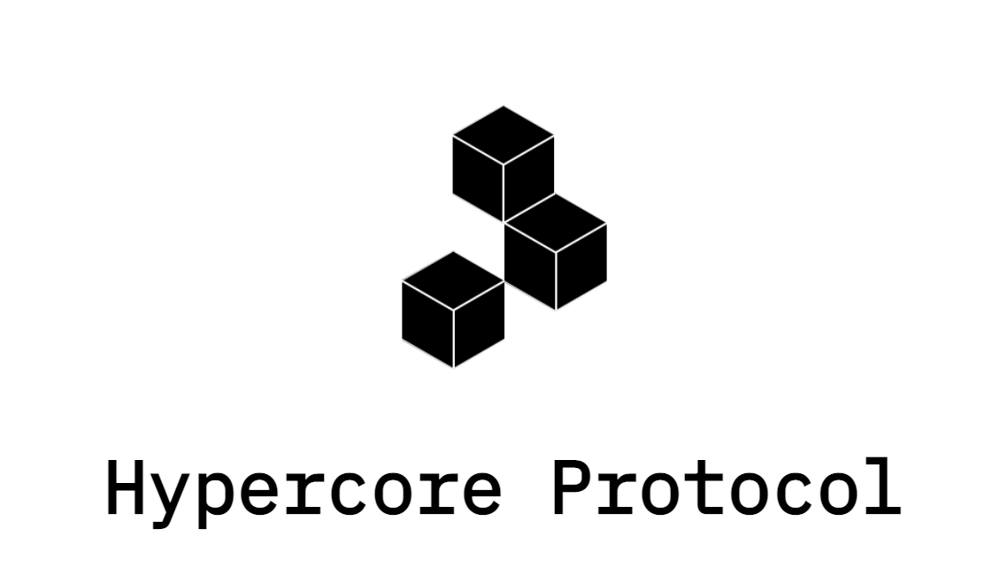

# HyperDrive

Is a colleage of IPFS but we believe it works better and more scalable.

The Digital twin adds following benefits

- data can never be lost
- unlimited scalability (can store petabytes)
- sync with other datasets e.g. automatic sync with your files on the [filemanager](filemanager)

## supported Features

- 2 way sync [DTFS](dtfs) with directoy into HyperDrive
- expose HyperDrive link for publish server
- link HyperDrive into filemanager (can be phase 2)

## more info

The Hypercore Protocol is inspired by BitTorrent. It creates networked datasets which users can seed in a distributed mesh. It also includes a variety of tools for connecting devices, streaming data, and running services.

- 100% compatible with https://hypercore-protocol.org/protocol/
