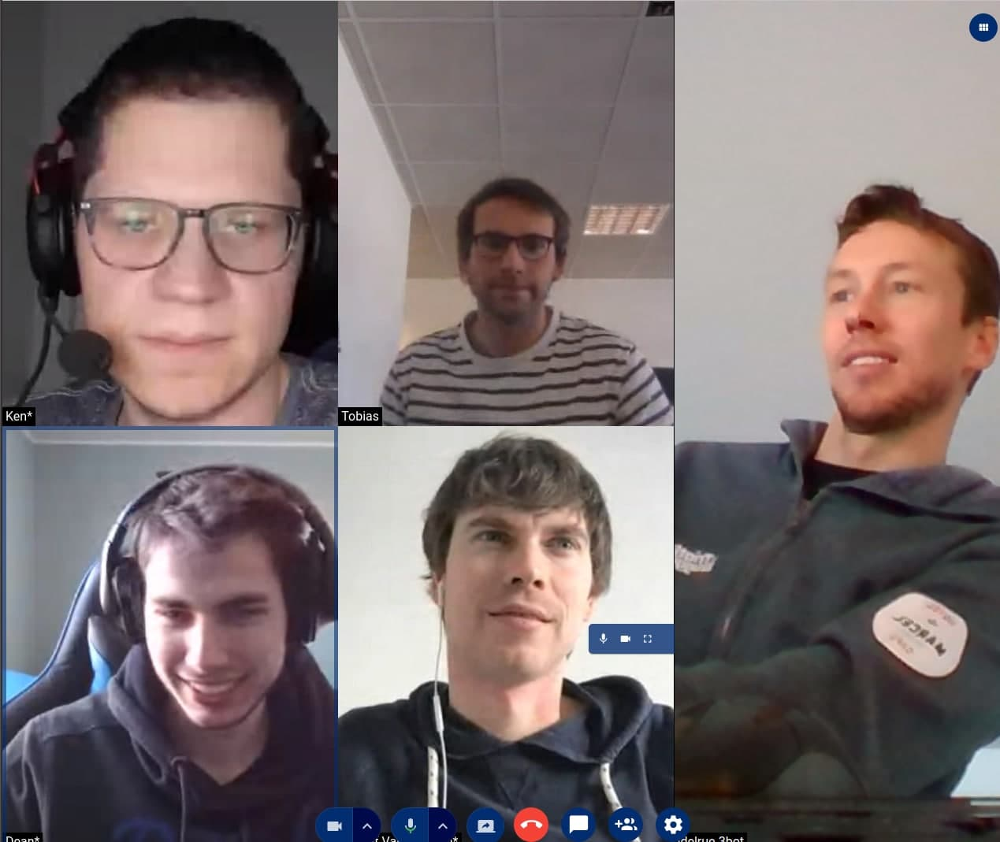

# DT Meet

## Meetings

Have your personal or professional meetings in the most private and peer-to-peer way.

## Features

- **Availability** - Available on any devide with a browser. Native app coming soon!
- **Secure** - Call are processed using your Digital Twin (or your host's Digital Twin). It is peer-to-peer encrypted open-source and transparent.
- **Private** - Your data is yours - only you decide where your recordings are stored & calls processed and who can access it.
- **Efficient** - Using multiplexing technology, streams are transmitted in most efficient way, without delays and unnecessary traffic to remote data-centers. 
- **Group conferencing** - Unlimited number of participants, depending on your available capacity.
- **Collaborative** - Everything you need for online collaboration - screen sharing, native chat integration, filesharing, recordings.

## Multiplexing

The video app is integrated in the ThreeFold_Grid and will support Multiplexing which will improve bandwidth use in comparison to other applications.
