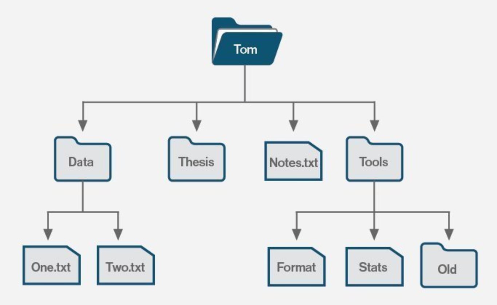

# Planetary Filesystem

A redundant filesystem, can store PB's (millions of gigabytes) of information.

Unique features

- unlimited scalable (many petabytes) filesystem
- zero-proof
  - on the TFGrid, no farmer knows what the data is about.
  - even a quantum computer cannot decrypt
- data cannot be lost
  - protection for [datarot](datarot), data will autorepair
- data is kept for every
- data is dispersed over multiple sites
- sites an go down, data not lost
- typically 10x more efficient than storing on clasic storage cloud systems
- can be mounted as filesystem on OSX, Linux, Windows, Docker, Kubernetes & TFGrid.
- compatible with +- all data workloads (not high performance data driven workloads like a database)
- self healing, when node or disk lost, storage system can get back to original redundancy level
- super easy to deploy compliant to regulations like GDPR.
- hybrid, can be installed onsite, public, private, ...
- read write caching on encoding node (the front end)

Is used by the [filemananger](filemananger)

## architecture

