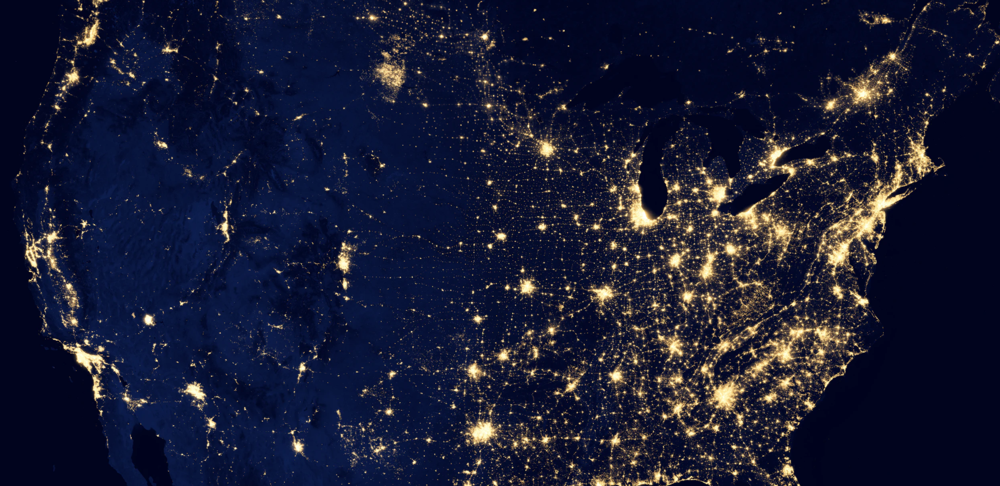

# Planetary Network

Unlimited scalable network, connects every user, digital twin and IT appliction running on the ThreeFold Grid.

Think about it like a network on top of the network which resolves some of the challenges today like redundancy, scale and security.

All traffic is encrypted, hackers do not see what is going on.

## Unique Features

- end 2 end encrypted
- each user and/or digital twin has a unique IP address which does not change over time or if internet network changes
- looks for shortest path between end points (e.g. if link goes down can look for other route)
- is a P2P system, our traffic can be routed over other nodes if this would be needed to reach our implementation

## architecture

## implementation

- based on Yggdrasil
- supports mobile & desktop clients = TFConnect
- ipv6 based, links to our quantum safe storage backend.
