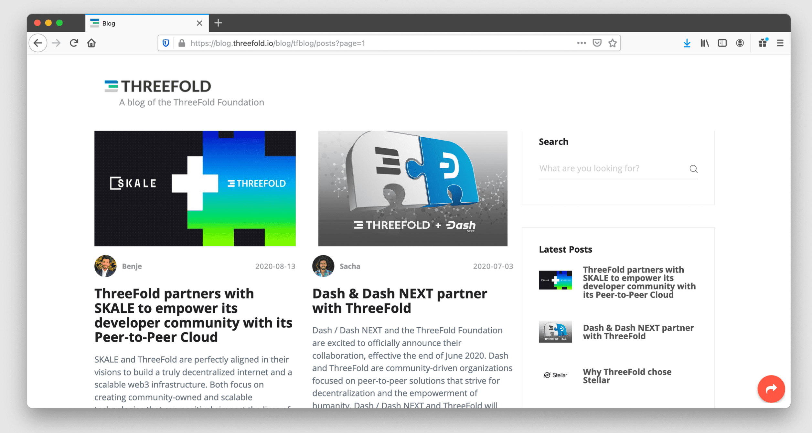
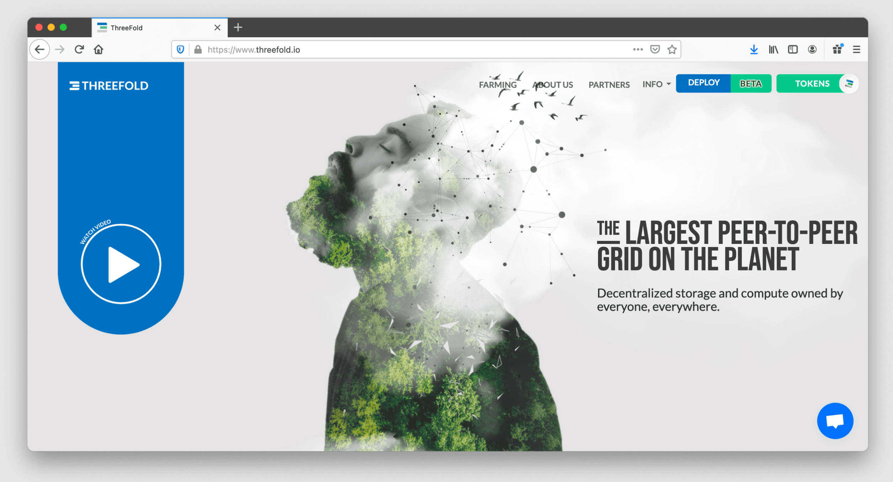

# Publishing System

Integrated Wiki & Website publishing system.

## Why

Allows the publishing of every kind of information from your digital twin directly over the planetary network to your audience.
All 100% private, verified, encrypted, ...

Can be used for education, news channels, websites, ...

## features

- support websites and/or wiki systems (knowledge base system like this one)
- code can be on github or other git based code management system
- intelligent knowledge base system (wiki as is used for this website)
  - include macro's
  - link checking
  - macro's for other visualization components
- supports the hyperdrive system, expose the content to other digital twin in a P2P way.
- supports gridsome or other website generation systems (we use this internally)

