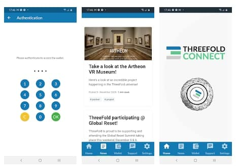

# ThreeFold Connect

Mobile tool for

- Authentication
- Wallet
- News
- Show notifications which are stored on Digital Twin

## Implementation

Authenticate with your decentralized apps using public-private key encryption in the most safe way. Manage your digital currencies as you would do with your banking app. Also includes Threefold news and fast chat-support.

Escalation of events. E.g. farm has issue, farmer needs to know, the TFConnect tries to let farmer know about the event. The escalations are stored in DT, but they need to be escalated to mobile device with certain urgency.

> TODO: discuss with Jimber team also timing
