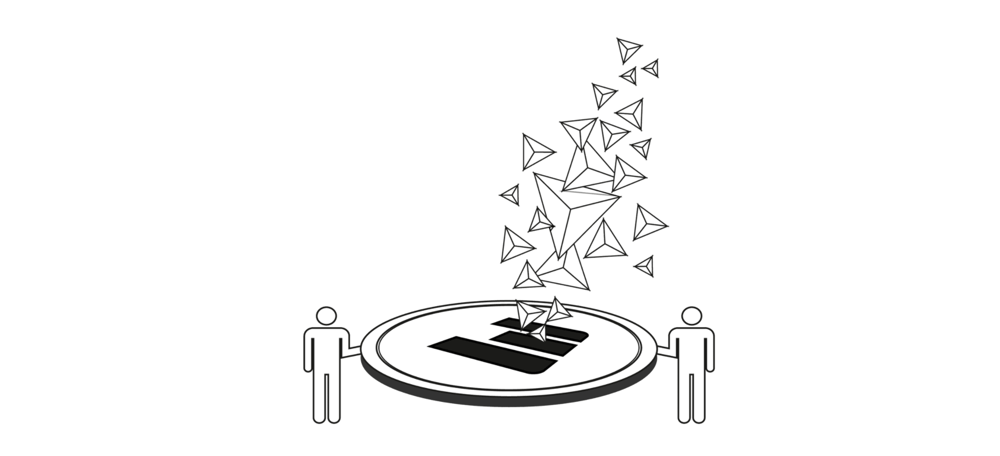

# ThreeFold Farmer Management System

The Threefold Farmer Management System stores information and data in relation to:

- farms and 3nodes
- pricing
  - CU/SU/NU
  - can be more than 1
  - can be linked to specific groups of users (customers)
  - can be linked to farms
- blacklist for customers:
  - specify who can use a 3node capacity
  - blacklist for consumers of capacity in relation to [3nodes](3node)
  - can be linked to farms
- reserve 3nodes (are reserved, not usable for capacity, but still count for farming)
- cultivation wallet: where does money come to as paid for users
  - can be linked to farms
- escalation to farmer when issues
  - over chat in DigitalTwin
  - e.g. node down, registration of capacity did not work, inability to do billing,...

executes on

- billing for the farmer
  - asks for payment to the right digital twin of the consumer using the [autopay](threefold:autopay) system.
- some basic health check & escalation to [notification system](notifications).

## Implementation

Accessible by Zero-OS and any other Digital Twin over Rest Interface.

In version 0.9 this will be done as data files which need to be editted, an use remote interface like ftp.

- specified in [dtml](threefold:dtml) or json
- accessible on [dtfs](threefold:dtfs)
- interface = [dtftp](threefold:dtftp)

> No UI features in 0.9 release, only editable over [DTFS](threefold:dtfs).

## Roadmap

- power management (< end March)
  - make sure that nodes which are reserved are turned on once a day to do the registration of uptime
- rating system for farmers & nodes
- monitoring overview of health of 3nodes