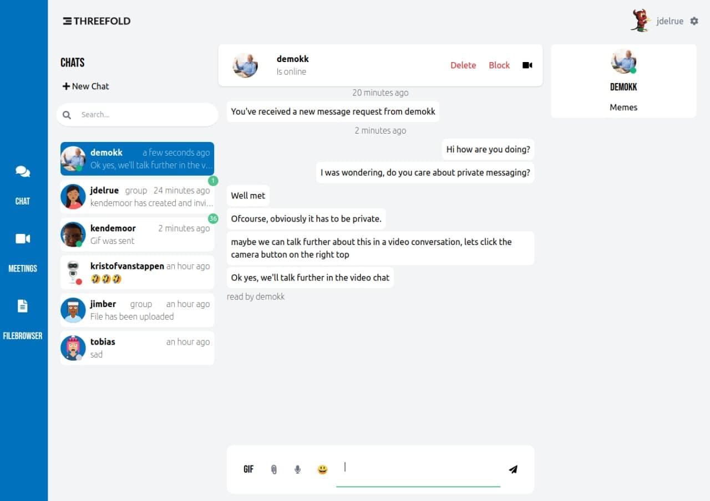

# Digital Twin Chat

## Get back your personal conversations

Using the chat tool in the DigitalTwin, you can use real peer-to-peer communication to safely and privately interact with other people in the Threefold network. Your Digital Twin will be constantly online, saving your messages for when you will be available to read them. Expect the same experience as the best messaging applications out there, but with improved privacy, safety and ownership.

## Features

Our MVP version will be provided with following features:

- **Availability** - Web-based by default and native app coming soon!
- **Functionality** - Everything you expect from modern convenient messaging app.
- **Secure** - Runs on your Digital Twin capacity with end-to-end encryption, fully open-source.
- **Privacy** - You and only you can decide where and how to store your messages
- **Video** - Video conferencing integrated with Meet
- **Manage** - You decide with who you want to chat. People can only contact you after approving their request. You can block or delete any contact whenever you want. You are in control. 

More features will be added in the future.
