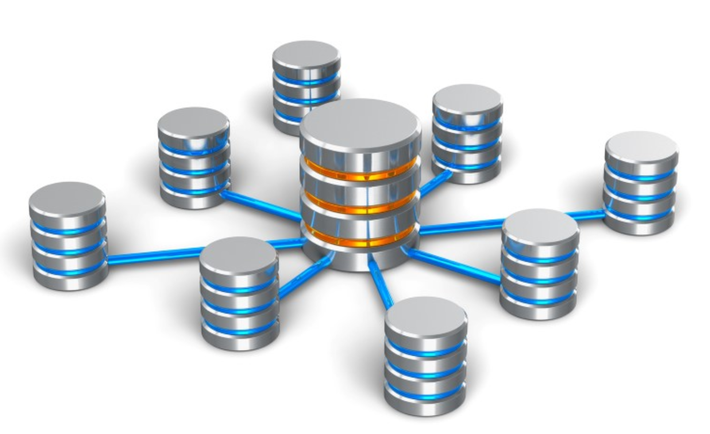

# Blockchain Database and O-db

Being built underneath the Blockchain Database (BCDB), the O-db is a key-value store using "always write" which allows history tracking, rollback features out-of-box and also ensures data consistency and improves performance. 

With the help of the 0-db, BCDB stores immutable data in an append-only fashion, implying that, in relation to the Digital Twin, it is used to store metadata locally such as access right & much more. 

