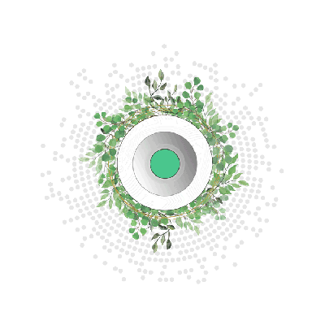

# How Does It Work

## Threefold Grid 

Digital Twin lives on top of Threefold Grid, a peer-to-peer and autonomous Internet grid that provides game-changing performance and empowers new possibilities. The Threefold Grid is made up of many servers distributed around the world - these servers are called 3Nodes, and they run the Zero-OS. 

Learn more about [Threefold Grid](twin_architecture).

## Zero-OS

Zero-OS is a lightweight and ultra-efficient open-source operating system that delivers three primitive functions: storage, compute and network capacity. A shelless operating system enables a fully autonomous internet, meaning that attackers cannot get in and no chance for error by IT professionals. 

Learn more about [Zero-OS](threefold:zos).

## 3Bot

Moreover, through the Threefold Tech decentralization technique, each user or organization gets a digital avatar called 3Bot. The deployment IT workload using "Smart Contract for It" makes the 3Bot deployment process resilient to human error and hacking. As a result, it is self-driving and self-healing. 

- **Self-driving**: 3Bot knows how to deploy IT and network capacity as required by the user or organization.
- **Self-healing**: it is programmed to auto repair issues.

3Bot forms part of the backbone of Digital Twin and manages all backend tasks. They run, all, autonomously in the network created around them - no people involved to run this network and keep it operational. This leads to much more security, efficiency, and higher performance. 

The 3Bot system allows Digital Twin to deploy itself along with its experiences on the Threefold Grid. 

- Learn more about [3Bot](threefold:3bot_def).
- Learn more about [Smart Contract for IT](tftech:smart_contract_for_it).

## Planetary Secure Network 

The architecture uses the Planetary Secure Network that connects everything with everyone in a direct peer-to-peer encrypted way. 

Learn more about [Planetary Secure Network](planetary_secure_network).

## Threefold Grid Blockchain - Twin Phonebook 

Next to the Planetary Secure Network stands the Threefold Grid Blockchain, a database built on top of Substate (A blockchain framework created by Parity). It will act as the Twin Phonebook, allowing Digital Twins to link with each other.  

Learn more about [Twin Phonebook](phonebook).

## Blockchain Database & O-db 

By now, linking each Digital Twin together on a peer-to-peer way, the Blockchain Database with its 0-db underneath will get involved to store metadata locally. It will have a central role of requesting access right to each Digital Twin before exchanging data. 

Learn more on [Blockchain Database & 0-db](bcdb_0db).

## Quantum-Safe Storage System 

The exchange data and the Digital Twin private data will be encrypted with a unique algorithm using equations and then dispersed and stored over multiple sites. Your data is secure and safe - Thanks to Quantum-Safe Storage System. 

Learn more about the [Quantum Safe Storage System](qsstoragesystem).

## More Information

We are using Threefold Technology to deploy our solution. Below are the links towards the different wikis: 
- [ThreeFold](http://wiki.threefold.io)
- [ThreeFold Tech](http://info.threefold.tech/)
- [ThreeFold Cloud](http://wiki.cloud.threefold.io)

