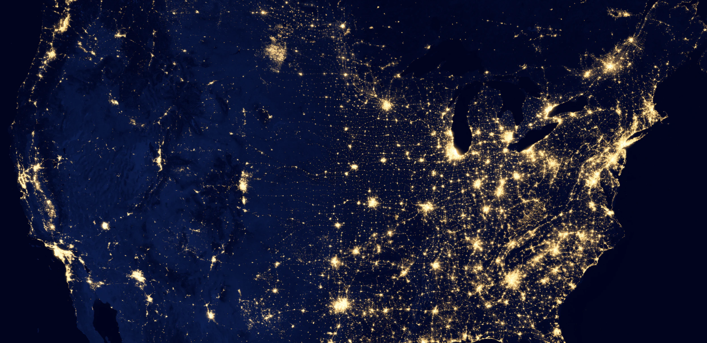
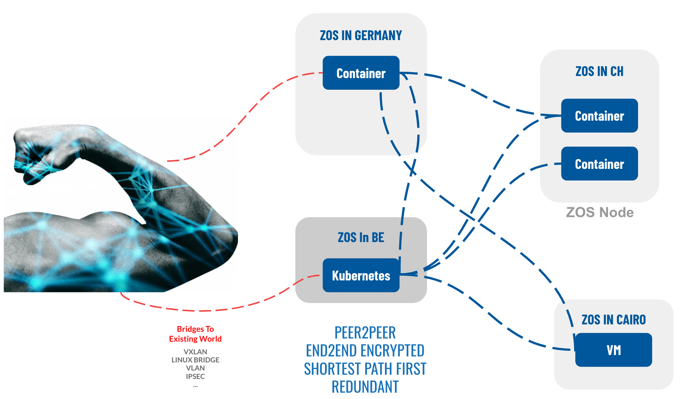

# Planterary Secure Network 

## How does it work?

Threefold is working on a Planetary Scalable LAN, a Peer-to-Peer network which connects everything with everyone in a direct peer-to-peer encrypted connection. 

All traffic between two Digital Twins will go over this Planetary Network. It is essentially end-to-end encrypted, meaning that all the exchange of data and information between two Digital Twins is encrypted - Only they can see, no one else. 

Next to the Planetary Network, there is the Threefold Grid Database which is a database built on top of Substrate (A blockchain framework created by Parity).  Every person will have an entry in this database, and so does each Digital Twin. This allows Twins to link with each other. 

Furthermore, these records will have some Digital Twin data attached to this traffic - Data will include the IP address of the Digital Twin in the Planetary Network. 

Since every Digital Twin has a unique ID in the database, Digital Twin can communicate with each other if they know their partners ID, and look up for the information required to reach them. 

## Benefit of Planetary Secure Network 

Our Planetary Network brings the following benefit to our Digital Twin and its architecture: 
- It finds the shortest possible paths between Digital Twins, 
- All of the data and information are end-to-end encrypted, 
- It allows for peer-to-peer links like meshed wireless, 
- It survives when internet links broke and re-route by itself when needed, 
- It resolves the shortage of IPv4 addresses (Internet Protocol Version 4)

## Architecture 

