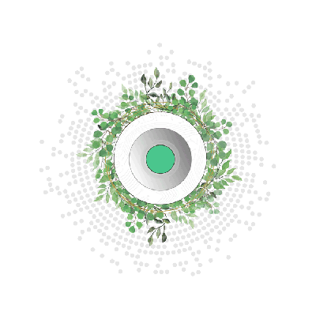

# How Does It Work

Let's dive deeper into Digital Twin!

Here, you will learn some of the fundamentals of how the digital twin works and how it is different from any other solution out there.

Digital Twin is a solution with unique [principles](our_vision).

Digital Twin's principles are made possible by deep integration and smart use of ThreeFold technology. We believe ThreeFold Foundation did a great job while creating this new type of architecture that enabled incredible new solutions to come alive. We are proud to move alongside ThreeFold Foundation and to provide this innovation to everyone.

To make our vision possible, Digital Twin actively uses different aspects of ThreeFold technology. To understand our architecture properly, a proper understanding of ThreeFold architecture is needed.

Below are some sources where you can find information about Threefold and its technology:
- [General ThreeFold Wiki](http://wiki.threefold.io)
- [ThreeFold SDK](http://wiki.sdk.threefold.io)
- [ThreeFold Tech](http://info.threefold.tech/)
- [ThreeFold Cloud](http://wiki.cloud.threefold.io)

Referencing to the general understanding of ThreeFold Technology, we can explain how exactly Digital Twin works. 

To some degree, Digital Twin works similarly to ThreeFold's 3Bot, and even more, it is based on 3Bot.

- [Architecture](twin_architecture)
- [Quantum Safe Storage System](qsstoragesystem)
- [Twin Phonebook](phonebook)
- [From Stars to Circles](stars_circles) 
- [Planetary Address System](addressing_system)
<!-- [peer2peer fairswap](p2p_swap) : TO BE DONE -->

<!--
- <b>Peer-to-Peer</b>: 
- <b>Decentralization</b>: 
- Autonomy: 
- Privacy & Security: 
- Efficiency: 
- Equality: 
-->
