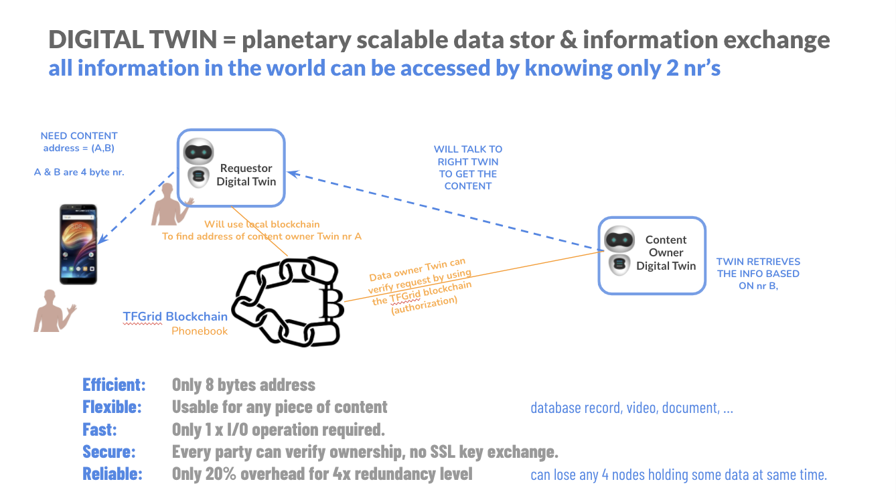

# Twin Phonebook 

As mentioned on the [Planetary Secure Network](addressing_system), the Threefold Grid Database, built on top of Substrate, will act as a “Phonebook” for Digital Twin. Furthermore, given your Twin’s unique ID (or any unique information), your Digital Twin will simply look up for all information required to connect to other Twins. 

