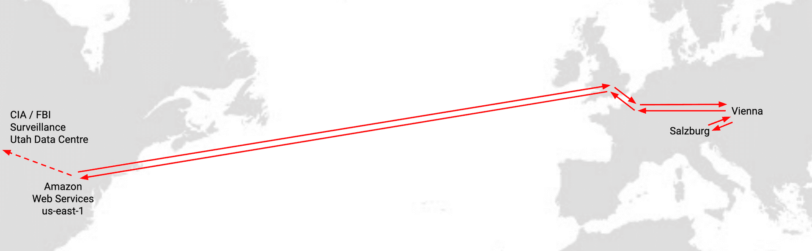
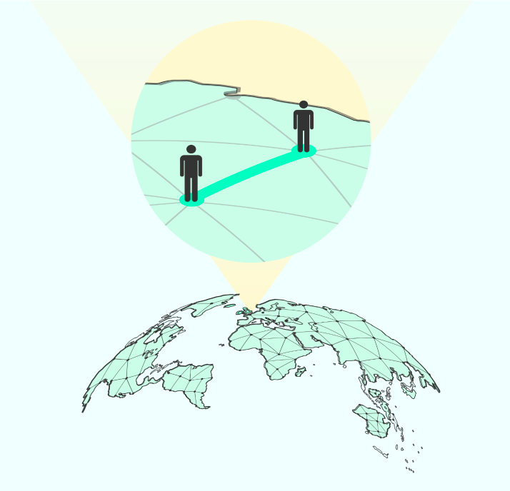

# Power of Peer-to-Peer

Today, online privacy and security are subject to controversial debate. Digital Twin believes that Peer-to-peer models and infrastructure empower communities with equality, sovereignty and resiliency. 

With the constant growing demand and use of user-friendly chat, video call or file storage applications, these centralized services create silos of users that can share and communicate with each other because they use the same tools. However, it allows the middle man - the chat, video or file storage platform - to collect and market data captured by end-user usage. 

### Example of the current problem

Zoom is a very popular video conferencing solution that provides free of charge services to its users. 

They changed their policy regarding how you connected through their platform to others users - all free-account users were connected through US-based Zoom (Central) infrastructure. 

This leads to very inefficient capacity usage and the potential for oversight by US agencies and authorities. 

## How our solution makes the difference 

Usually, when two persons want to talk, they connect directly with no intermediary in between. Why do we need to go through any infrastructure or middle entity that is not in line to make the connection? 

Using the Threefold Grid along with the Planetary Secure Network, you will be able to chat directly with your peers, create and store your files & data in your storage without the fear of them being stolen and watched. 

