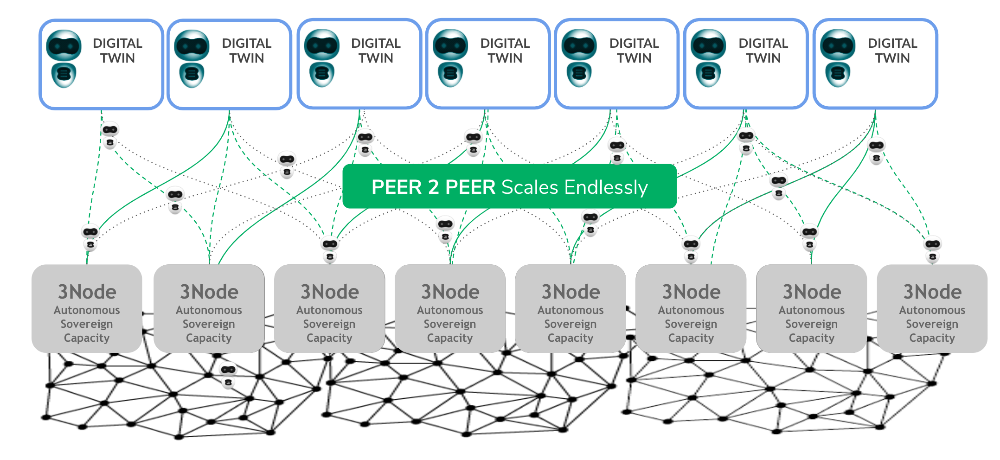

# Digital Twin Architecture

Created by Threefold, Threefold Grid is a peer-to-peer and autonomous Internet Grid that provides game-changing performance and empowers new possibilities. With +500 servers delivering +80,000,000 GB of online storage across 110+ locations in 21+countries, the ThreeFold Grid is the most considerable peer-to-peer Internet in the world.

It is made up of many servers called 3Nodes distributed worldwide by independent people and organizations called Farmers. 3Nodes run a unique operating called Zero-OS, a lightweight and ultra-efficient open-source operating system allowing the Threefold Grid to be fully autonomous - meaning that hackers cannot get in and no chance for errors from IT Professionals. 

Digital Twin lives on top of Threefold Grid to deploy its solution. Along with Zero-OS and 3Bot, it provides the right backbone architecture to allow each digital Twin to be self-healing and self-driving. 

Without the Threefold Grid, our unique solution would not be possible. 

- Dive deeper into Threefold Grid, [here](threefold:threefold_grid).
- Learn more about Zero-OS, [here](threefold:zos).
- Learn more about 3Bot [here](internet4:3bot).

