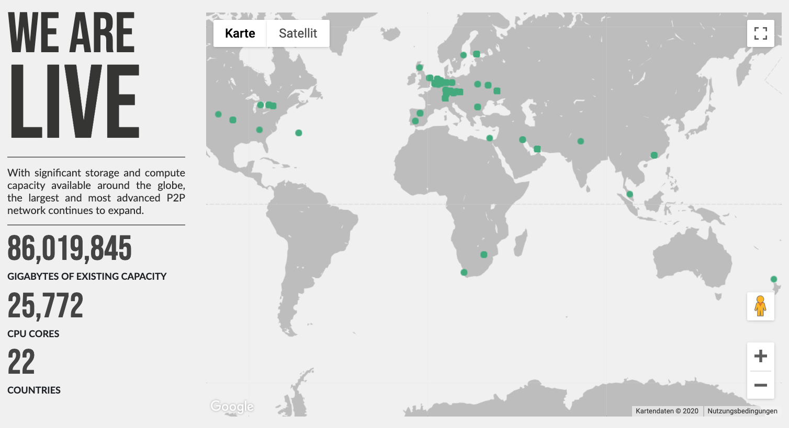

# 3Node

**3Nodes** are computers (servers) being a low-level provider for the IT capacity of the Cloud. 

# Zero-OS

**Zero-OS** is a lightweight and efficient operating system which allows the 3Nodes to be used to provide the IT capacity required by the solutions running on the ThreeFold Grid. 

In other words, 3Nodes are servers that run Zero-OS software. They provide storage, compute, and network capacities. Together, 3Nodes make up the capacity layers for the ThreeFold Grid. 

## Benefits of Zero-OS

- Up to 10 times more efficient for certain workloads (for example; storage).
- No installation is required. 
- All files are deduped for the Virtual Machine's containers and the Zero-OS itself - Therefore, no more data. duplicated filesystems. 
- The Hacking footprint is very small, which leads to a much more safe system 
  - Every file is fingerprinted and is checked during an application launch time. 
  - There is no shell or server interface on the operating system. 
  - The network is end-to-end encrypted between the nodes. 
- There is the possibility to completely disconnect the compute or storage from the network service part which means hackers have far less chance to get to the data. 
- A Smart Contract for IT layer allows groups of people to deploy IT workloads with consensus and full control. 
- All workloads working on Linux can run on Zero-OS but in a much more controlled, private, and safe manner. 

Dive deeper into the Zero-OS primitives [here](zos_primitives.md)