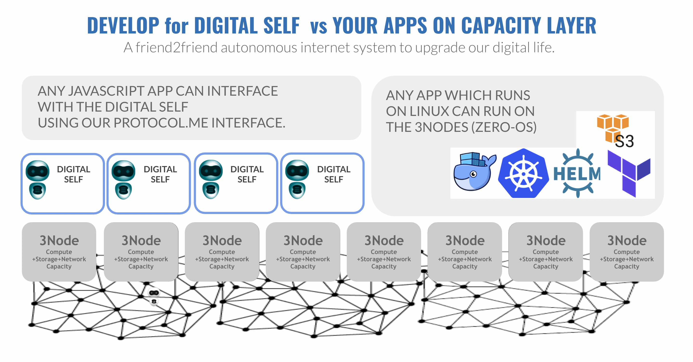

# Digital Self Architecture Overview 

This section provides a high-level overview of Digital Self Technology.

ThreeFold Grid is the first peer-to-peer and autonomous Internet Grid that provides game-changing performance and empowers new possibilities. It is made up of many servers called 3Nodes distributed worldwide by independent people and organizations called Farmers. 

3Nodes runs a unique operating system called Zero-OS, a lightweight and efficient operating system allowing them to provide the IT capacity required by the solutions running on the ThreeFold Grid. 

On top of that, 3Bot technology enables the ThreeFold Grid to be fully autonomous and self-healing. Users can access the ThreeFold Grid using their Digital Self, a virtual system administrator that executes the commands (reservation of capacity, sending messages, store files, build applications, etc.) directly on the operating system level via a smart contract for IT. 

# Technology Overview 

To dive deeper into the technology and know-how all components merge with each other, please go through the following sections: 
- [3Nodes and Zero-OS](3node_zos)
- [Zero-OS primitives](zos_primitives)
- [Smart Contract for IT](smart_contract_for_it)
- [Quantum Safe File Storage](qsfs)
