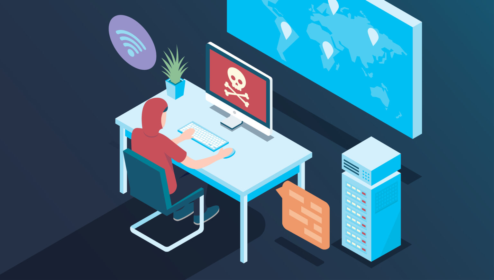

# Current social media platforms are too insecured

 
*Illustration from Cybintsolutions*

News has emerged. The Giants of Social Media and Networking platforms have been hacked. Following the news of a similar occurrence involving Facebook with around 533 million users' data leaked, LinkedIn joined the group with over 500 million user's data being stolen and posted on various platforms by attackers. Additionally, the Pwn2Own annual competition revealed that Microsoft Teams and Zoom have security vulnerability issues. All these important tools to your eyes revealed themselves not to have adequate technology and structure secured enough for its user’s data. It is time for a CHANGE. 

Due mostly to the global pandemic, collaboration and social media platforms have taken up intimate positions in our lives, helping maintain personal ties physical isolation. However, these current platforms have been revealed to be greatly vulnerable to attackers. On one side, Facebook, followed by LinkedIn, have been attacked, and around 500 million of their user's data, each, have been stolen - Data includes profile name and ID, email addresses, phone numbers, workplace information and many more. Security experts warn that leaked data could be used not only for marketing purposes but also for impersonating people and committing fraud. On the other side, Microsoft and Zoom have been exposed by benevolent hackers to have weaknesses in their security system during the annual Pwn2Own competition. 

## Facts

Cyberattack is one of our global major problems. Following are some important facts: 
- There is a hacker attacker every 39 seconds, 
- 43% of cyberattacks target small business, 
- The global average cost of a data breach is $3.9 million across Small & Medium Business (SMBs),
- Since COVID-19, a 300% increase in cybercrime has been reported, 
- Connected IoT devices are expected to reach 75 billion by 2025, 
- 95% of cybersecurity breaches are due to human error, 
- Most companies take, on average, nearly 6 months to detect a data breach, even major ones. 

Using this current infrastructure and unsustainable centralized system are not working anymore, and it is time for a change—a change towards a trustworthy digital world where people feel secure and comfortable to socialize with their community members. 
What if the solution is waiting next to your door? Digital Twin provides you with [Social](social_experience) and [Network](network_experience) which are fully peer-to-peer, secure, private and decentralized. Built on top of the Threefold Grid and with its autonomous technology & architecture, Digital Twin provides you with seamless experiences.

## How is it better?

### Autonomous 

Built on top of the Threefold Grid and thanks to the Zero-OS, Digital Twin is resilient to human error and hacking. As a result, it is self-driving and self-healing. 

- Learn more about [Threefold Grid](tfgrid_twin).
- Learn more about [Zero-OS](tfgrid:zos).

### Private 

The current centralized infrastructure does not ensure the privacy of the users. Every time you send a message, that message travels to the data centre where the messaging application you are using is hosted - this applies to all centrally-hosted email, video, social media and search applications you are using. Therefore, this allows these companies to have unlimited access to your information. 

With the help of the Threefold Peer-to-Peer Internet and Planetary Secure Network, you will be able to connect directly with your peers - no intermediaries. 

- Learn more about the [Power of Peer-to-Peer](power_of_p2p).
- Learn more about [Planetary Secure Network](planetary_secure_network).

### Quantum-Safe

With pieces of data dispersed in multiple sites and with a unique algorithm, the Quantum-Safe Storage System ensures your data and information safety. 

- Learn more about [Quantum Safe Storage](qsstoragesystem).

### Connect only with people that you know 

Don't get hassle anymore with people that you do not know. Social Media platform is meant to be a digital environment where you want to feel comfortable sharing information & stories and connect only with the right people. The Twin Phonebook allows it to happen by requesting specific information about the other Digital Twin. 

- Learn more about [Twin Phonebook](phonebook).

To understand more about how these different components work together, we encourage you to go on ["How does it work"](twin_technology). 