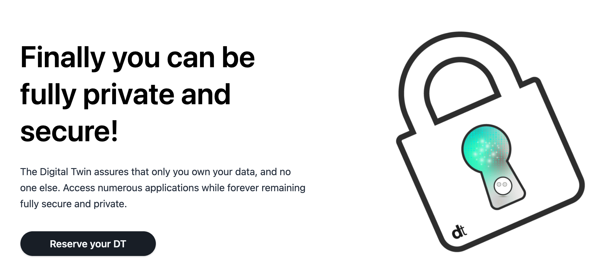
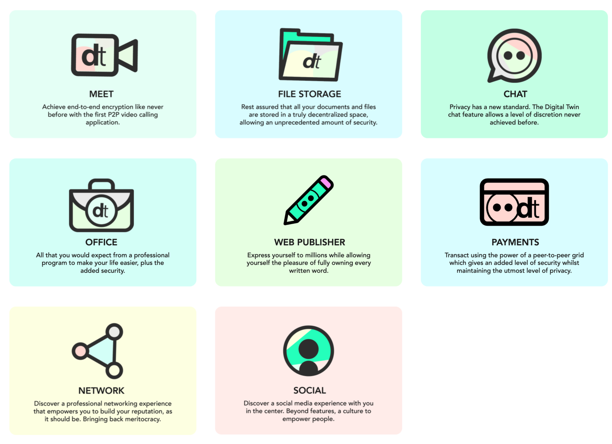
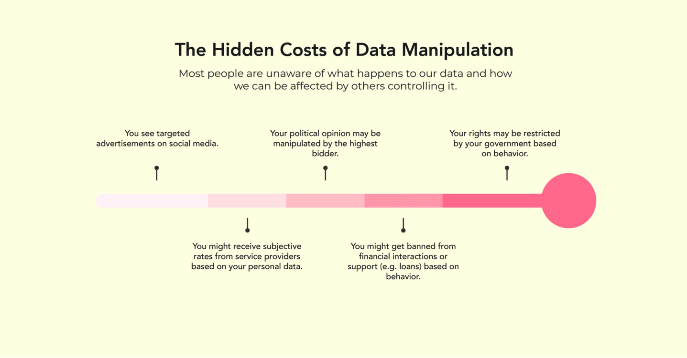

# Digital Twin Experiences

The first implementation of your digital life online, see https://mydigitaltwin.io/.

Digital Twin Experiences are a primary use case on top of the ThreeFold Grid.

Digital Twin is you as autonomous digital being on the grid which gives back the ownership of your data to only you – and no one else.

Digital Twin is a response to today’s reality, your escape from the many popular centralized and often-abused applications used by a big majority of the planet. It grants you full access to a 100% neutral and decentralized digital life.

First implementation of Digital Twin (march 2021) has following features

- filemanager (manage all your files, photos, …)
- office documents & collaboration
- video & audio conferencing tool
- chat tool (full peer2peer)
- web and wiki publishing tool
- Peer2Peer secure networking layer

### Why

More information see [digital twin why](why_digital_twin)

### Features

- secure, sustainable private alternative to whatsapp, dropbox, msoffice, zoom, ...
- additional wallet and soon peer2peer exchange of digital currencies
- additional publishing environment
- all in 1 experience
- soon added social media and networking app

### Some screenshots

- [file manager, office](aydo)
- [chat](twin_chat)
- [video conferencing](kutana)
- [login](twin_login)

### Roadmap

- Q2 2021: 
  - working proof of concept implementation with all features
  - available as opensource on threefold grid in test mode for chosen test group
- Q3 2021: 
  - available for private deployments (through partners)
  - price: 5-20 eur per person per month depending features
- Q4 2021:
  - Roll out on ThreeFold Grid as experience on top of TFGrid
  - Dual license model

### Architecture

see [tfgrid_twin](tfgrid_twin)

!!!include:twin_toc

!!!def alias:digitaltwin_experiences,dtwin_experiences