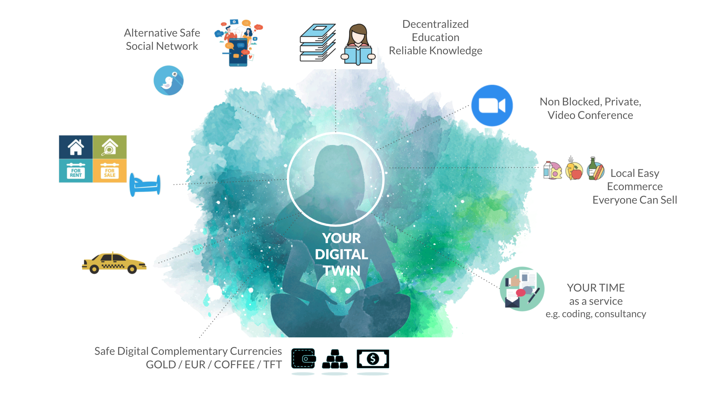
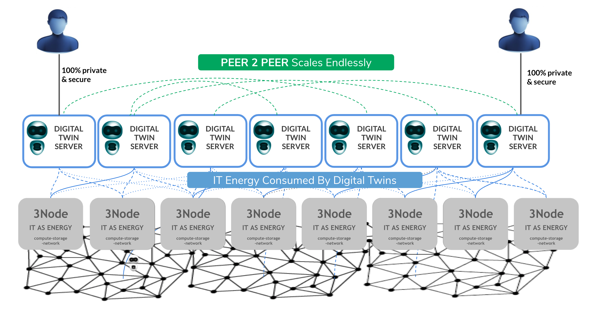
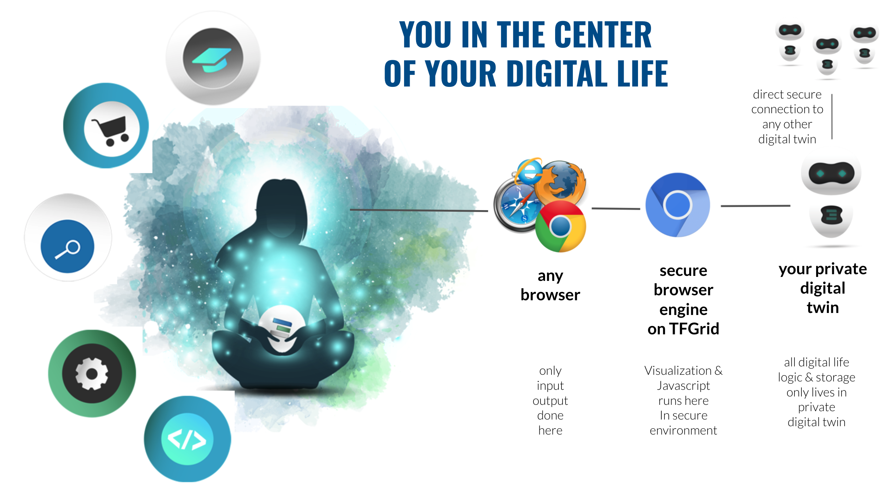
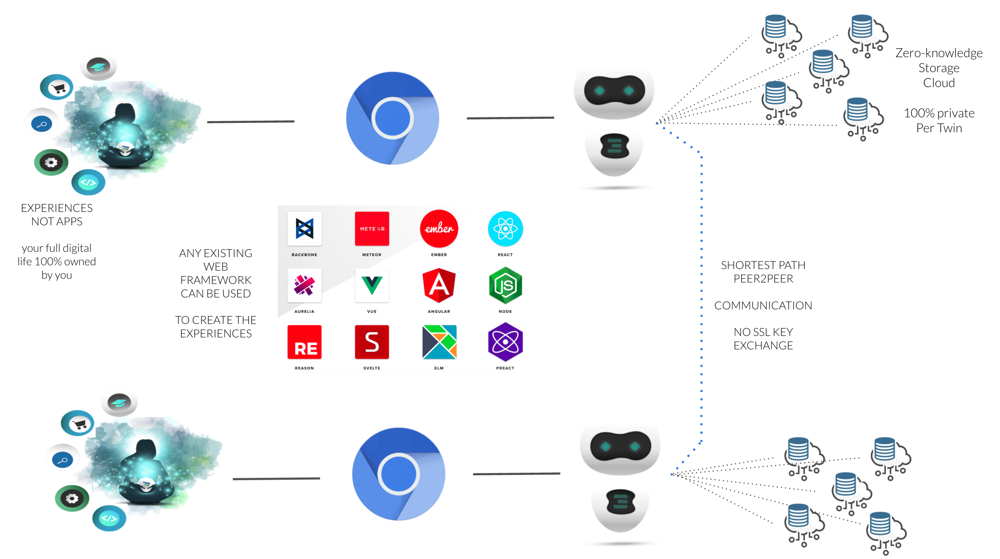
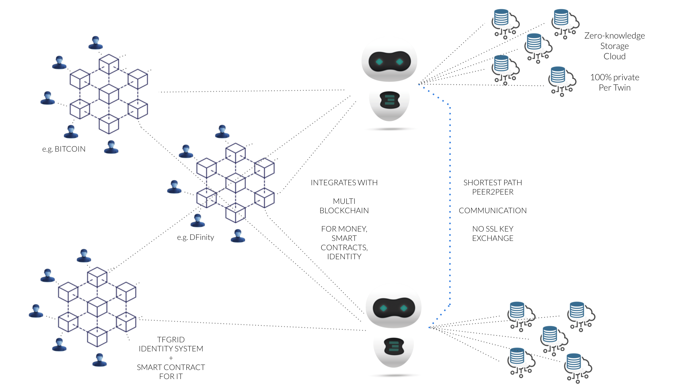
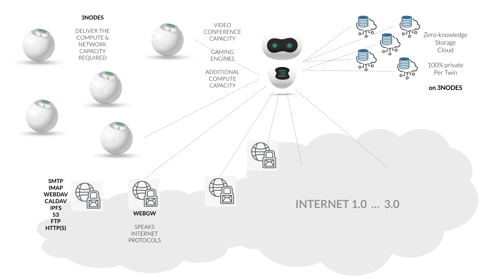

# Digital Twin Hub

 

The idea of the Digital Twin Hub is to be your backend for your digital life.

This system scales for ever, there are no limits.

You can see how each user connects to their private Digital Twin Hub and how all Digital Twin Hubs connect to each other.

We use a digitaltwin_phonebook to make sure the digital twin's can secure the connections between themselves.

A user will use any browser and through that browser use a secure browser engine which will then talk to your person Digital Twin Hub. This is a very secure way how to access your digital life.

### Any developer can create experiences on top

Any javascript framework can be used.

Because so many more primitives are available on the digita twin its much more easy to develop an experience.

#### Example primitives

- message (chat, email alternative) between twins
- store/retrieve any file, video, image on twin
- give access to any file
- manage your contacts, groups (circles)
- manage your video conferencing needs
- manage your reputation and the reputation of your friends
- manage your agenda
- manage your digital currency wallets
- manage your identity
- manage your digital money (exchanges, sell/buy, ...)

a lot of automation is available because of the peer2peer nature of the digital twin's.

### Multi blockchain world

We believe in a world where there will be many blockchain systems, mainly for smart contracts, identity and money.

The Digital twin does the heavy lifting to allow you to interact with the blockchains which might be relevant for you.

There is nothing to do for you as a user.

### Compatible with existing world.

The digital twin knows how to talk to the outside world and can even offer interfaces which are compatible with the existing internet v1 and v2 (imap, smtp, ...).

Existing client server apps can be installed on the 3nodes and as such the twins can still interect with these existing client server systems.

!!!include:tfgrid:i4_storage_architecture

!!!def alias:digital_twin_server,dtwin_server,dtwin_hub,digital_twin_hub