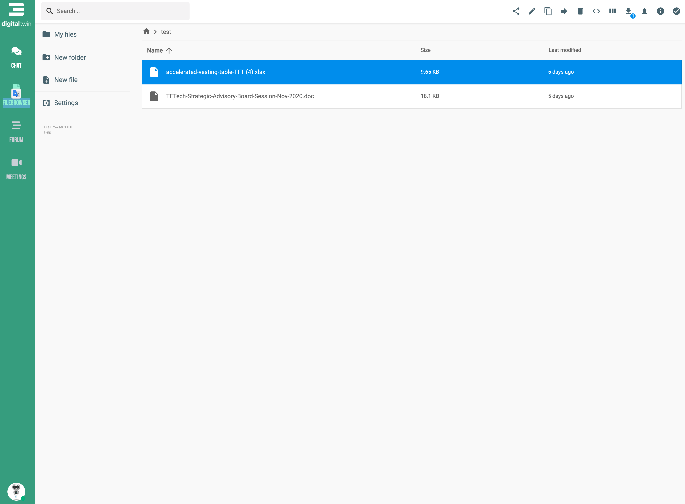
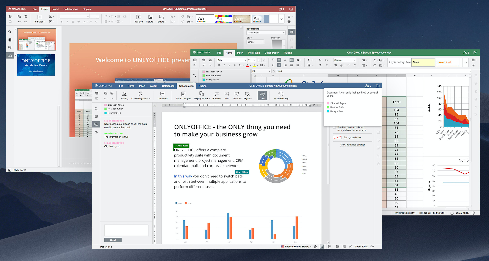

## Features

### Compatibility 

Photos, videos, presentations, PDFs, Office files, and more! All file formats and systems you may use are compatible with your file storage. 

### Data Can Never Be Lost

Keep your data safe and private with the most secure and reliable workspace on the market. Go hassle-free and ensure your files remain accessible even in the unlikely situation that your smartphone, tablet or computer goes down.

### Sharing Made Simple 

Keep your files private to yourself and those with whom you want to share them. Protection layers like password, comment or edit view, expiring links, or viewing invitations are integrated to ensure your shared files where they should. 

### Affordable Storage 

The unique storage algorithm behind Digital Twin makes it possible for you to enjoy 100x more space for the same price. Cost-effective and more sustainable!

### Ultra-Secure 

Experience the first quantum safe permanent storage solution on the market. Protected by autonomous technology, your files are stored without the fear of being stolen. 

### Easy Access

Being web-based, your File Storage can be accessed on any device, from anywhere around the world. All you need is your login information, and you're good to go!

All compatible with MS Office:

