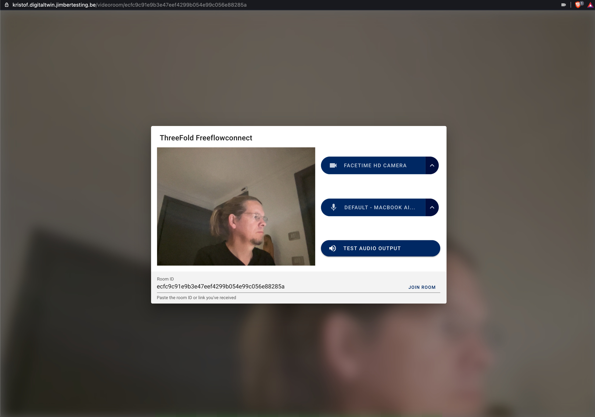
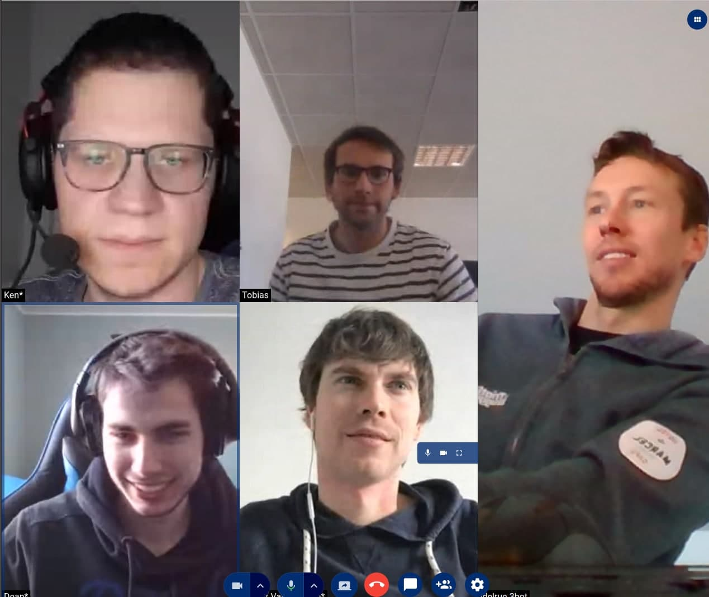

Meet will be provided with the following features:

### Ultra-Secure

Enjoy the most secure end-to-end encryption (powered by the open-source Digital Twin Protocol) in the world. And a unique storage algorithm ensures your data can't be hacked or lost.

### Privacy

More than just an option, privacy is the foundation of how Digital Twin works. 

Running on the ThreeFold grid, no centralization.

### Everywhere for Everyone

Have face-to-face conversations with an unlimited number of participants. From family meetings and group hangouts to yoga classes and business meetings – everything can happen on Meet without calling charges. 

Talk, video chat, record, share screens and files all in one place. There is no need to switch between platforms – everything you need for online collaboration is integrated into your Meet experience.

