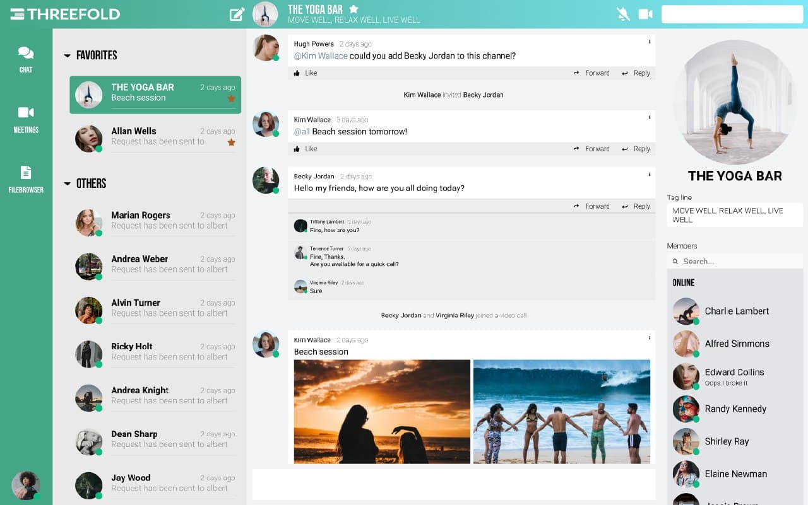

# Getting Started

Digital Twin accompanies you since the beginning. In order to get started comfortably, follow the steps below: 

- Install [ThreeFold Connect](threefold:threefold_connect) on your mobile phone
  - TF Connect is your new Authentication System and your wallet
- Go to the Digital Twin Bootstrap service and create your Digital Twin
  - Link: https://digitaltwin.jimbertesting.be/
- Log in with your Threefold Connect
- Answer questions to define where you want your Digital Twin to be run
- Advance to https://yourTwinName.twin.grid.tf and your Digital Twin webinterface will be launched
- Re-login (authenticate) to inform your Digital Twin that it is you - for additional security purpose

Now, you can start your new digital life journey. 

Share your thoughts, share your files and share you mind.

### The Interface

This is the original design of our interface:

### Full Integration

There is a full integration between all components - they are all interrelated to enhance your experience in this new digital world. 

Experiences:
- [Chat](twin_chat)
- [Meet](meet)
- [Social](social_experience)
- [Network](network_experience)
- [File Storage](aydo)
- [Office](twin_office)
- [Publisher](threefold:publisher) 
- [Payment](payment)