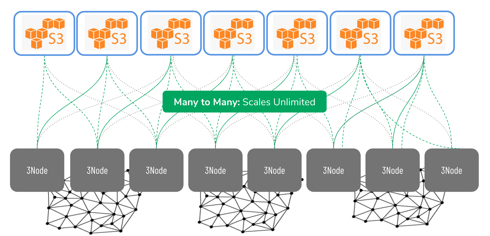

# Quantum Safe Storage System 

Traditional remote storage stores data in one datacenter - implying that if this data centre is hacked, the attacker can steal your data. 

This data can be secured by encryption, but most traditional encryption algorithms are known to be “not quantum-safe” - For instance, a quantum computer can easily break the encryption. 

As a result, the Quantum-Safe Storage of Threefold has been chosen. It provides an algorithm that does not replicate parts of an object (file, photos, movie or any other documents) but rather try to visualize as a set of equations. 

These equations are then dispersed and stored over multiple sites. Your data is encrypted, then distributed over different physical locations. Therefore, even if one site is compromised, the hacker will only have data coming from this particular site. 

Additionally, he will need more data from other places before recreating the information and then decrypt it to get the original. 

If you want to dive deeper into Quantum-Safe Storage’s algorithms and data encryption, we encourage you to check the [Quantum Safe Storage Concept of Threefold](tfgrid:qsss). 