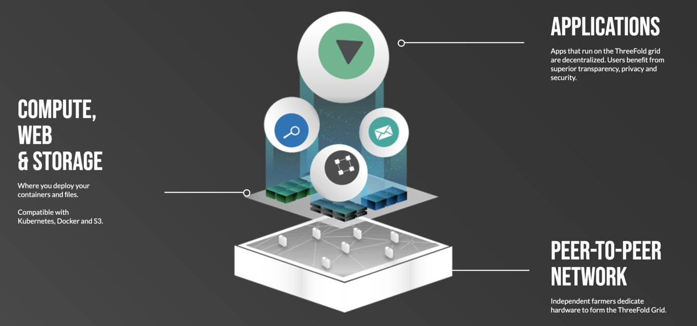

# Technology

- IT Capacity : 3Nodes running our operating system ZOS provide Storage,Compute, Network to the world.
- Digital Twin: every person get's a digital_twin_server, this is the center of your digital life
- On top of this digital twin anyone can build experiences: digitaltwin_experiences
- These digital twins live on top of the ThreeFold grid.

!!!include:technology_toc
