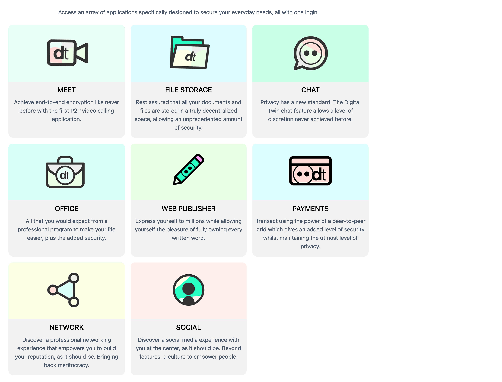
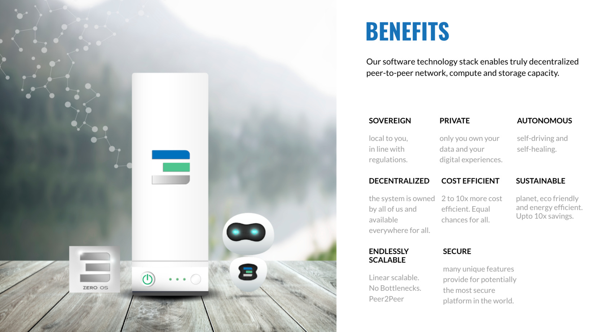

# Digital Twin

Your private digital life hub, all of your requirements for your digital life on 1 location.

The Digital Twin assures that only you own your data, and no one else. Access numerous applications while forever remaining fully secure and private.


## Experiences On Top Of Digital Twin



| projects                             | description                                                                           |
| ------------------------------------ | ------------------------------------------------------------------------------------- |
| [AYDO](threefold_internal:aydo_acp)                     | All Your Data Online = your own private secure google drive/docs alternative          |
| [FreeFlow Circles](threefold_internal:freeflow_hub)     | Your private peer2peer facebook, linkedin, whatsapp, youtube, medium ... system       |
| [Mitaa](threefold_internal:mitaa)                       | Fairswap system, fair Peer2Peer ecommerce system, swap anything for anything globally |
| [Kutana](accelerator:kutana)                     | Your own zoom alternative system, private data sovereign video conferencing system    |
| [hercules_browser](threefold_internal:hercules_browser) | Peer2Peer browser engine, runs on top of ThreeFold Grid                               |
| [Business Twin](threefold_internal:businesstwin)        | Your company with legal license & full business backend tool for <100 eur per month   |
| [Tapr](accelerator:tapr)                         | **personal** dream AI driven analizing platform, on top of digital twin               |
| [Shareitt](threefold_internal:shareitt)                 | peer2peer marketplace for exchanging used items by meand of complementary currency    |

## Future

- The current version is being developed through opensource contributions from multiple companies like Codescalers, ThreeFold & Jimber.
- Its our aim to streamline development from within ACP. 
- Funding need 2-5m EUR
- ThreeFold will donate 50m TFT to ACP
  - these tokens can be sold to further develop the Twin and the experiences.


```charty
{
  "title":  "Profile",
  "config": {
    "type":    "rating",
    "labels":  true,
    "numbers": true,
    "groups":  5
  },
  "data": [
    { "label": "High Tech",  "value": 5 },    
    { "label": "Sustainability",     "value": 5 },
    { "label": "Product Ready",  "value": 3 },
    { "label": "Market Traction", "value": 0 },
    { "label": "Sales Focus",  "value": 0 },
    { "label": "End User Focus",  "value": 5 },
    { "label": "Future Value",  "value": 5 }
  ]
}

```


!!!def alias:Crystal_Twin,digital_twin_hub,digital_twin,digital_twin_server



