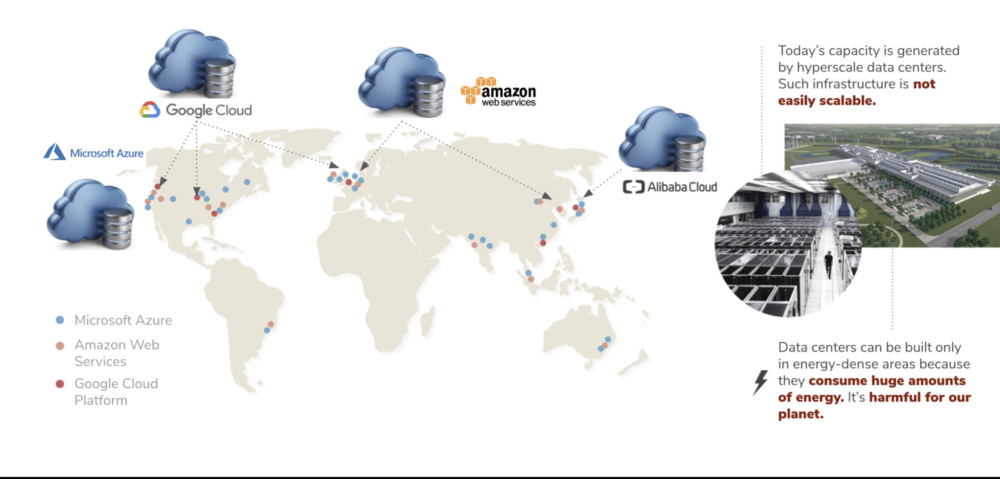

# Decentralization of Digital Infrastructure

To serve emerging digital workloads such as edge computing, IoT, 5G, AI, swarm learning, VR, autonomous transport, blockchain, and more, the world requires scalable, ultra-secure, and decentralized digital capacity everywhere, on-demand.

Today, more than 80% of the Internet’s capacity is owned by centralized cloud providers. The capacity is derived from hyper-scale data centres - an incredibly costly infrastructure, not scalable and super unsustainable. As of today, the Internet consumes about 10% of global energy resources.

Moreover, data centres which are located in a handful of locations in wealthy nations, are where all of your crucial data is currently stored. Your photos, emails, chats, videos and every single part of your digital identity is tracked, stored and used by someone else. 

We believe that centralization is the key problem of our existing unsustainable system. It concentrates on decision-making and operates as a transmission mechanism to transmit and amplify the effects of centralized decisions throughout the system. This means that when bad decisions are made - as inevitably happens in human behaviour and nature - the entire system will be damaged.
 

The current centralized infrastructure and system can also lead to immoral activities such as mass surveillance that affect our human right and freedom. It enables significant power imbalances and damaging people’s autonomy and dignity. 

# Peer-to-Peer as the solution 

Today, online privacy and security are badly compromised with this centralized architecture and various intermediaries' implication. The exchange of real values becomes impossible. Digital Twin believes that peer-to-peer models are the solution to empower communities with equality, sovereignty, sustainability and resiliency. 
Digital Twin uses Threefold Peer-to-Peer Network power to provide you with privacy and security while enjoying a seamless experience. 
Learn more about Peer-to-Peer, [here](power_of_p2p).