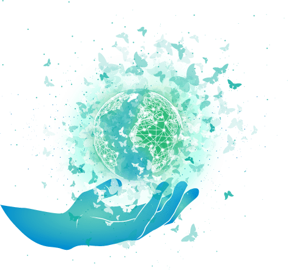

# Digital Twin Benefits

With the help of Threefold technologies, we can provide you with a fully secured, private, decentralized and peer-to-peer new digital world. 

Digital Twin provides you with a solution that is: 

## Sovereign

The control over our data has become increasingly important. With Digital Twin, you regain full power over your data. You decide who can or cannot collect, store, and process your data/information while still complying with all the local country's data privacy regulations. 

## Private 

With our architecture that prevails privacy, you are the only one who owns your data and digital experiences - No one else. 

## Autonomous 

With 3Bot as part of Digital Twin's backbone, it enables your Twin to be self-driving, meaning that it knows how to deploy the required IT and network capacity and self-healing, implying that it is programmed to auto-repair issues. 

## Decentralized 

We believe that decentralization is one of the critical solutions to improve the current architecture. Our system is owned by all of us and available everywhere for all - no one is excluded. 

## Cost-effective 

We are deploying a solution that is 2 to 10 times more cost-efficient on the market. We want to restore equal chances for all of us - no boundaries anymore.

## Sustainable and endlessly scalable 

Being on top of the Threefold Grid and using the Threefold Peer-to-peer Network enables our solution to be eco-friendly and energy-efficient. 

Learn more how peer-to-peer network provides a more sustainable solution, [here](power_of_p2p).

## Secure 

By using the Quantum-Safe Storage, it enables the Digital Twin's data to be fully secured. 

Learn more about how the technologies behind Digital Twin work together to provide these 
benefits [here](twin_technology). 

