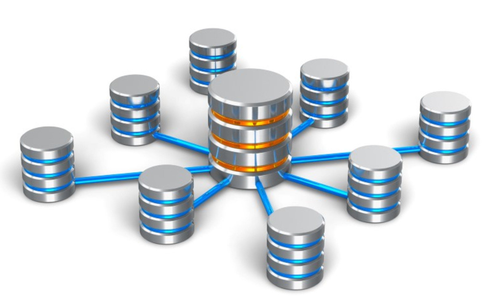

# Blockchain Database and 0-db

Being built underneath the Blockchain Database (BCDB), the 0-db is a key-value store using "always write", which allows history tracking, rollback features out-of-box, and ensures data consistency and improves performance. It will also be a key component for the Blockchain Database to know if a Digital Twin has updated its access right. 

With the help of the 0-db, BCDB stores immutable data in an append-only fashion, implying that it is used to store metadata locally, such as access right in relation to the Digital Twin.

